Comandos Linux
==============


+ obs: Algumas imagens e descrições foi usado como base do site <a href = "https://diolinux.com.br/"> Diolinux</a>, que é o meu site favorito sobre Linux. 😁

<a href = "#ubuntu"> Ubuntu </a>
<a href = "#fedora"> Fedora </a>
<a href = "#arch-linux"> Arch Linux </a>
<a href = "#snap"> Snap </a>
<a href = "#flatpak"> Flatpak </a>

***
## Mudar a senha do root:
Se você tentou usar o comando "su", para entrar no modo superuser, e deu que a senha do root está errada, tem como mudar a senha dele, é bem simples, para mudar a senha do root, primeiros usaremo o comando:

```bash
sudo passwd root
```

Depois de digitar e confirmar a nova senha, temos que desbloquear o uso dela:

```bash
sudo passwd -u root
```

# Comandos básicos do Linux:

## CD

O comando "cd" serve para você navegar dentro dos diretórios pelo terminal, o comando "cd nomedapasta" é para você entrar na pasta que você quer, e "cd .." para voltar uma pasta, exemplo:

```bash
cd Documentos
```

Ele vai entrar no diretório "Documentos", e caso você queira voltar uma pasta, basta digitar:

```bash
cd ..
```

Que ele vai voltar para a pasta anterior da pasta "Documentos", que normalmente é a pasta principal, que fica o usuário, que seria a pasta "/home/nomedousuario".

## PWD

O comando pwd vai mostar em qual diretório você está, passando o caminho completo, por exemplo digamos que você esteja na pasta Fontes, que está dentro da pasta Downloads, se você digitar o comando:

```bash
pwd
```

Ele vai mostrar "/home/nomedousuario/Downloads/Fontes", sendo "/" o diretório principal do Linux, e "/home" onde fica os usuários.

## LS

O comando "ls", serve para você listar os arquivos dentro de um diretório(pastas) em que você está, ou outro diretório, passando o caminho completo. Por exemplo, digamos que você está na pasta "Documentos", se você digitar um "ls" e der Enter, ele vai mostrar todos os arquivos que tem na pasta "Documentos", exemplo:

```bash
ls
```

Se você quer ver todos os arquivos do diretório, incluindo os arquivos ocultos(que começam com ".", exemplo: ".git"), basta digitar:

```bash
ls -a
```

Se você quer ver os arquivos em formato de lista, e com as data de modificação e tamaho de cada pasta/arquivo, basta digitar:

```bash
ls -l
```

E se você quer ver das duas últimas formas juntas, basta digitar:

```bash
ls -la
```

Ele vai mostrar todos os arquivos em formato de lista, incluindo os arquivos ocultos.

E se você quer ver oque tem em outro diretório sem ter que entrar nele, basta digitar o "ls" seguido do caminho do diretório, exemplo:

```bash
ls /home/gabriel/Downloads
```

Ele vai listar todos os arquivos dentro do diretório Downloads, e "gabriel" é o nome de usuário.

## MKDIR

O comando "mkdir" serve para você criar um novo diretório, basta digitar:

```bash
mkdir nomedapasta
```

Exemplo:

```bash
mkdir Pasta-de-Exemplo
```

Se você quer separar o nome da pasta por espaço, basta digitar usando "\" para separar os nomes, por exemplo:

```bash
mkdir nome\ da\ pasta
```

Exemplo:

```bash
mkdir Pasta\ de\ Exemplo
```

Se você não colocar a "\", ele vai criar várias pastas cada uma com um nome que foi separado pelo espaço. Caso você queira criar uma pasta em outro diretório basta passar o caminho completo de onde você quer criar a pasta:

```bash
mkdir nome\ da\ pasta /home/nomedeusuario/Documentos
```

Exemplo:

```bash
mkdir Pasta\ de\ Exemplo /home/gabriel/Documentos
```

## Touch

O comando "touch" é parecido com o "mkdir", so que ele é para criar arquivos e não diretórios, por exemplo para criar um arquivo de bloco de notas, basta digitar:

```bash
touch arquivo.txt
```

Exemplo:

```bash
touch comandos-linux.txt
```

Depois do "." você sempre coloca a extensão do arquivo que você quer criar, .txt para arquivos de texto comum, que é os de bloco de notas, .js para arquivos JavaScript e etc.

## RMDIR

O comando "rmdir" server para você excluir permanentemente diretórios vazios, ele não exclui diretórios que contenham arquivos dentro. Para usá-lo basta digitar:

```bash
rmdir nomedapasta
```

Exemplo:

```bash
rmdir Pasta\ de\ Exemplo
```

## RM

O comando "rm" é parecido com o "rmdir", ele também exclui permanentemente, ele é mais usado para excluir arquivos, mas também tem como usá-lo para excluir diretórios que estejam cheios, então TOME BASTANTE CUIDADO quando for usá-lo. Para usá-lo para excluir algum arquivo basta digitar:

```bash
rm nomedoarquivo
```

Exemplo

```bash
rm comandos-linux.txt
```

Para excluir um diretório usando o "rm", basta adicionar um "-r" depois do "rm", por exemplo:

```bash
rm -r nomedapasta
```

Exemplo

```bash
rm -r Pasta\ de\ Exemplo
```

Ele vai excluir permanentemente o arquivo/pasta, então tome cuidado quando for usá-lo para não apagar algum arquivo ou diretório que não queira.

## NANO

O comando "nano" é um editor de arquivos pelo terminal, ele serve para você editar o arquivo pelo próprio terminal sem ter que abrir algum outro programa de edição de texto, exemplo:


```bash
nano nomedoarquivo.extensao
```

Exemplo

```bash
nano comandos-linux.txt
```

Para salvar oque foi editado pelo "nano", basta apertar as teclas "Crtl + S", e para sair basta apertar "Ctrl + X".

## MV

O comando "mv" serve para você mover arquivos ou pastas para outro diretório, mas tome cuidado ao usar, pois se você não passar o caminho corretamente você pode perder o arquivo ou pasta, ou se mover para algum diretório que tenha algum arquivo/pasta com o mesmo nome, ele vai sobrescrever o arquivo. Para usá-lo basta digitar:

```bash
mv nomedoarquivo caminhoparaondequermover
```

Exemplo:

```bash
mv comandos-linux.txt /home/gabriel/Imagens
```

Se você quer mover vários arquivos ou pasta de uma vez, basta digitar o nome de todos os arquivos ou pastas antes do caminho, separados por espaço. Exemplo:

```bash
mv comandos-linux.txt Estudos/ fontes.zip /home/gabriel/Imagens
```

Ele vai mover todos os arquivos e pastas digitados para o diretório "Imagens".

## CP

O comando "cp" é parecido com o comando "mv", a diferença que ele é para copiar e não para mover, mas caso você copie para um diretório que tenha algum arquivo/pasta com o mesmo nome, ele também vai sobrescrever com o "mv" faz. Para usá-lo basta digitar:


```bash
cp nomedoarquivo caminhoparaondequermover
```

Exemplo:

```bash
cp comandos-linux.txt /home/gabriel/Imagens
```

Se você quer copiar vários arquivos de uma vez, basta digitar o nome de todos os arquivos ou pastas antes do caminho, separados por espaço. Exemplo:

```bash
cp comandos-linux.txt fontes.zip /home/gabriel/Imagens
```

Ele vai copiar todos os arquivos digitados para o diretório "Imagens". Para copiar alguma pasta com o comando "cp", basta colocar um "-r" depois do "cp" para ele copiar o diretório. Exemplo:

```bash
cp -r Linux/ Estudos/ fontes/ /home/gabriel/Imagens
```

## Wget

Se voce gosta de usar o terminal para tudo, tem um comando que você pode usar para baixar as coisas que você quiser, basta digitar:

```bash
wget urlexemplo
```

Exemplo:

```bash
wget https://redirector.gvt1.com/edgedl/android/studio/ide-zips/4.2.2.0/android-studio-ide-202.7486908-linux.tar.gz
```

Neste link de exemplo estaremos baixando o Android Studio. Se você estiver baixando um arquivo grande, e tiver medo de dar algum problema como a energia acabar, ou a internet dar algum problema, basta usar um "-c" para fazer com que caso o download pare, ele continue de onde parou, por exemplo:

```bash
wget -c https://redirector.gvt1.com/edgedl/android/studio/ide-zips/4.2.2.0/android-studio-ide-202.7486908-linux.tar.gz
```

Bastando apenas você colocar o mesmo comando novamente, caso tenha tido algum problema no download que ele vai continuar de onde parou.

E se você também quer compactar ou descompactar arquivos ou pastas pelo terminal é bem simples, vou colocar uma lista com todos os formatos de arquivos que o Linux suporta e como compactar e descompactar cada um.

# Compactar e Descompactar arquivos e pastas:

Antes de ensinar como compactar e descompactar, vamos ensinar como instalar alguns formatos de compactação que não vem padrão no Linux.

## 7-Zip:

Para instalar o 7-Zip no Ubuntu basta digitar:

```bash
sudo apt install p7zip-full
```

No Fedora basta digitar:

```bash
sudo dnf install p7zip
```

No Arch Linux basta digitar:

```bash
sudo pacman -S p7zip
```

## RAR:

Para instalar o formato rar no Ubuntu, basta digitar:

```bash
sudo apt install rar unrar
```

## Gzip e Bzip:

Para instalar o formato .gz e .bz2 no Arch Linux, basta digitar:

```bash
sudo pacman -S gzip bzip2
```

Ele vai instalar  os dois pacotes juntos, o gzip e o bzip já vem como padrão no Ubuntu e Fedora, e para qualquer outro programa que você queira instalar, você pode instalar vários de uma vez só, basta digitar o comando de gerenciador de pacotes da distro, no caso do Ubuntu o apt, o Fedora o dnf, e o Arch Linux o pacman, e install com o nome dos pacotes separados por espaço, no caso do Arch é um pouco diferente, no lugar de "install", é "-S", que seria referente a "install", das outras distros,  exemnplos:

Ubuntu:

```bash
sudo apt install gimp krita inkscape obs-studio
```

Fedora:

```bash
sudo dnf install gimp krita inkscape obs-studio
```

Arch Linhx:

```bash
sudo pacman -S gimp krita inkscape obs-studio
```

Nos três exemplos será instalado o Gimp, o Krita, o Inkscape e o Obs Studio.

## Formato .zip

Todos conhecem o formato .zip né? Ele é padrão em todos os Sistemas Operacionais, e aqui vai como compactar e descompactar pelo terminal arquivos .zip:

### Compactar:

Para compactar é bem simples basta digitar:

```bash
zip -r nomedoarquivo.zip nomedapasta/
```

Sendo o "nomedoarquivo.zip" o arquivo .zip que sera gerado, e o "nomedapasta/" é a pasta que será compactada. Por exemplo:

```bash
zip -r fontes.zip Fontes/
```

O nome do arquivo ".zip" você pode colocar o nome que quiser para identificar oque é aquele arquivo ".zip". 

Se você quer compactar vários arquivos ou pastas dentro de apenas um arquivo .zip, basta digitar:

```bash
zip -r nomedoarquivo.zip arquivo1 arquivo2 arquivo3
```

Exemplo:

```bash
zip -r fontes.zip Fontes/ Fontes-Sans-serifas/ Fontes-Personalizadas
```

Ele vai gerar um arquivo .zip com todos os arquivos que você escolheu ou com todas as pastas escolhidas sem precisar criar uma nova pasta e colocar tudo dentro de apenas uma pasta para compactar todos juntos.

Se você quer compactar alguma pasta e colocar uma senha, também é bem simples, basta digitar:

```bash
zip -P senha -r nomedoarquivo.zip pasta/
```

Exemplo:

```bash
zip -P zipando -r  fontes.zip Fontes/
```

E na hora que você ou outra pessoa for descompactar, vai pedir essa senha que você colocou, no meu caso a senha foi "zipando".
### Descompactar:

Para descompactar um arquivo ".zip" é mais simples ainda do que compactar, basta digitar:

```bash
unzip nomedoarquivo.zip
```

Exemplo:

```bash
unzip fontes.zip
```

Se você quer descompactar para outra pasta, basta digitar:

```bash
unzip nomedoarquivo.zip -d caminho/da/pasta
```

Exemplo:

```bash
unzip fontes.zip -d /home/gabriel/Downloads
```

E o arquivo será descompactado na pasta Downloads. Se você deseja ver os arquivos que tem dentro do arquivo.zip, basta digitar:

```bash
unzip -l nomedoarquivo.zip
```

Exemplo:

```bash
unzip -l fontes.zip
```

E ele vai mostrar todos os arquivos que tem dentro do arquivo.zip.

## Formato .rar

Assim como o formato ".zip" é bastante conhecido, o formato ".rar" provávelmente é mais conhecido ainda, pois a maioria das pessoas usam o famoso Winrar.
### Compactar:

Para compactar é bem simples, basta digitar:

```bash
rar a nomedoarquivo.rar pasta/
```

Exemplo:

```bash
rar fontes.rar Fontes/
```

Se você quer compactar vários arquivos ou pastas dentro de apenas um arquivo .rar, basta digitar:

```bash
rar a nomedoarquivo.rar arquivo1 arquivo2 arquivo3
```

Exemplo:

```bash
rar a fontes.rar Fontes/ Fontes-Sans-serifas/ Fontes-Personalizadas
```

Ele vai gerar um arquivo .rar com todos os arquivos que você escolheu ou com todas as pastas escolhidas sem precisar criar uma nova pasta e colocar tudo dentro de apenas uma pasta para compactar todos juntos.

Se você quer compactar alguma pasta e colocar uma senha, também é bem simples, basta digitar:

```bash
rar a nomedoarquivo.rar pasta/ -p
```

Exemplo:

```bash
rar a fontes.rar Fontes/ -p
```

E ele vai pedir para você digitar uma senha para o arquivo.

### Descompactar:

Para descompactar é bem simples também, basta digitar:

```bash
unrar x nomedoarquivo.rar
```

Exemplo:

```bash
unrar x fontes.rar
```

Para descompactar em outra pasta basta digitar:

```bash
unrar x nomedoarquivo.rar caminho/
```

Exemplo:

```bash
unrar x fontes.rar /home/gabriel/Downloads
```

E o arquivo será descompactado na pasta Downloads. Se você deseja ver os arquivos que tem dentro do arquivo.rar, basta digitar:

```bash
unrar l nomedoarquivo.rar
```

Exemplo:

```bash
unrar l fontes.rar
```

E ele vai mostrar todos os arquivos que tem dentro do arquivo.rar.

## Formato .tar

TAR ou tar (abreviatura de Tape ARchive), é um formato de arquivamento de arquivos (ficheiros). Apesar do nome "tar" ser derivado de "tape archive", o seu uso não se restringe a fitas magnéticas. Ele se tornou largamente usado para armazenar vários arquivos em um único, preservando informações como datas e permissões. Normalmente é produzido pelo comando "tar". Apesar de ser mais comum em sistemas Unix-Like, este formato é suportado pela maioria dos descompactadores para Windows, como por exemplo o 7-zip.

tar também é o nome de um programa de arquivamento desenvolvido para armazenar e extrair arquivos de um arquivo tar (que contém os demais) conhecido como tarfile ou tarball. O primeiro argumento para tar deve ser uma das seguintes opções: Acdrtux, seguido por uma das seguintes funções adicionais. Os argumento finais do tar são os nomes dos arquivos ou diretórios nos quais eles podem ser arquivados. O uso de um nome de diretório, implica sempre que os subdiretórios sob ele, serão incluídos no arquivo.

### Compactar:

Para compactar é bem simples, basta digitar:

```bash
tar -cvf nomedoarquivo.tar pasta/
```

Exemplo:

```bash
tar -cvf fontes.tar Fontes/
```

Se você quer compactar vários arquivos ou pastas dentro de apenas um arquivo .tar, basta digitar:

```bash
tar -cvf nomedoarquivo.tar arquivo1 arquivo2 arquivo3
```

Exemplo:

```bash
tar -cvf fontes.tar Fontes/ Fontes-Sans-serifas/ Fontes-Personalizadas
```

Ele vai gerar um arquivo .tar com todos os arquivos que você escolheu ou com todas as pastas escolhidas sem precisar criar uma nova pasta e colocar tudo dentro de apenas uma pasta para compactar todos juntos.

### Descompactar:

Para descompactar um arquivo ".tar", basta digitar:

```bash
tar -xvf nomedoarquivo.tar
```

Exemplo:

```bash
tar -xvf fontes.tar
```

Para descompactar em outro pasta:

```bash
tar -xvf nomedoarquivo.tar -C caminho/da/pasta/
```

Exemplo:

```bash
tar -xvf fontes.tar -C /home/gabriel/Downloads
```

E o arquivo será descompactado na pasta Downloads. Se você deseja ver os arquivos que tem dentro do arquivo.tar, basta digitar:

```bash
tar -tvf nomedoarquivo.tar
```

Exemplo:

```bash
tar -tvf fontes.tar
```

ou

```bash
tar -tf fontes.tar
```

E ele vai mostrar todos os arquivos que tem dentro do arquivo.tar.

## Formato .tar.gz

Os formatos TGZ e TBZ (ou tar.gz e tar.bz2, respectivamente) são usados para a compressão e descompressão de arquivos em sistemas Unix. No Linux, esses formatos são reconhecidos de forma nativa e os arquivos podem ser facilmente extraídos - como acontece com o .ZIP, no Windows.

### Compactar:

Para compactar um arquivo para ".tar.gz", basta digitar:

```bash
tar -cz nomedapasta > arquivo.tar.gz
```

Exemplo

```bash
tar -cz Fontes/ > fontes.tar.gz
```

ou

```bash
tar -zcvf arquivo.tar.gz nomedapasta/ 
```

Exemplo

```bash
tar -zcvf fontes.tar.gz  Fontes/
```

Se você quer compactar vários arquivos ou pastas dentro de apenas um arquivo .tar.gz, basta digitar:

```bash
tar -zcvf nomedoarquivo.tar.gz arquivo1 arquivo2 arquivo3
```

Exemplo:

```bash
tar -zcvf fontes.tar.gz Fontes/ Fontes-Sans-serifas/ Fontes-Personalizadas
```

Ele vai gerar um arquivo .tar.gz com todos os arquivos que você escolheu ou com todas as pastas escolhidas sem precisar criar uma nova pasta e colocar tudo dentro de apenas uma pasta para compactar todos juntos.

### Descompactar:

Para descompactar um arquivo ".tar", basta digitar:

```bash
tar -zxvf nomedoarquivo.tar.gz
```

Exemplo:

```bash
tar -zxvf fontes.tar.gz
```

Ou

```bash
tar -vzxf fontes.tar.gz
```

Ou

```bash
tar -xz Fontes/ < fontes.tar.gz
```

Aqui o "Fontes/" sendo o nome da pasta que será gerado após descompactar.

Ou

```bash
tar -czf fontes.tar.gz Fontes/
```

Como no exemplo anterior, "Fontes/" é o nome da pasta que será gerado após descompactar o arquivo.

Ou

```bash
tar -xzf fontes.tar.gz
```

Ou

```bash
tar -xf fontes.tar.gz
```

Ou

```bash
tar -vczf fontes.tar.gz Fontes/
```

Como em outros exemplos, "Fontes/" é o nome da pasta que será gerado após descompactar o arquivo.

Ou

```bash
tar -vxf fontes.tar.gz
```

Para descompactar em outro pasta:

```bash
tar -zxvf nomedoarquivo.tar.gz -C caminho/da/pasta/
```

Exemplo:

```bash
tar -zxvf fontes.tar.gz -C /home/gabriel/Downloads
```

E o arquivo será descompactado na pasta Downloads. Se você deseja ver os arquivos que tem dentro do arquivo.tar.gz, basta digitar:

```bash
tar -ztvf nomedoarquivo.tar.gz
```

Ou

```bash
tar -tvf nomedoarquivo.tar.gz
```

Ou

```bash
tar -tf nomedoarquivo.tar.gz
```

E ele vai mostrar todos os arquivos que tem dentro do arquivo.tar.gz.

## Formato .bz2

O formato de arquivo BZ2 é compatível com o software que pode ser instalado na plataforma do sistema Linux, Mac OS, Windows. Arquivos com extensão BZ2 são categorizados como arquivos Arquivos comprimidos. O subconjunto Arquivos comprimidos compreende 230 vários formatos de arquivo.

### Compactar:

Para compactar um arquivo para .bz2, tem quer ser so arquivos com alguma extensão mesmo, como por exemplo: "arquivo.tar", que ficará: "arquivo.tar.bz2", e para adicionar essa extensão ".bz2", basta digitar:

```bash
bzip2 -z nomedoarquivo.extensao
```

Exemplo:

```bash
bzip2 -z fontes.tar
```

Que se tornará um arquivo "fontes.tar.bz2".

### Descompactar:

Para descompactar um arquivo .bz2 é bem simples, basta digitar:

```bash
bunzip nomedoarquivo.bz2
```

Ou 

```bash
bunzip2 nomedoarquivo.bz2
```

Exemplo:

```bash
bunzip2 fontes.bz2
```

Ou qualquer arquivo que termine com ".bz2", no caso ele so vai remover a extensão ".bz2".

## Formato .tar.bz2

Os formatos TGZ e TBZ (ou tar.gz e tar.bz2, respectivamente) são usados para a compressão e descompressão de arquivos em sistemas Unix. No Linux, esses formatos são reconhecidos de forma nativa e os arquivos podem ser facilmente extraídos - como acontece com o .ZIP, no Windows.

### Compactar:

Para compactar um arquivo ou pasta para ".tar.bz2", basta digitar:

```bash
tar -jcvf nomedoarquivo.tar.bz2 pasta/
```

Exemplo:

```bash
tar -jcvf fontes.tar.bz2 Fontes/
```

Se você quer compactar vários arquivos ou pastas dentro de apenas um arquivo .tar.bz2, basta digitar:

```bash
tar -jcvf nomedoarquivo.tar.bz2 arquivo1 arquivo2 arquivo3
```

Exemplo:

```bash
tar -jcvf fontes.tar.bz2 Fontes/ Fontes-Sans-serifas/ Fontes-Personalizadas
```

Ele vai gerar um arquivo ".tar.bz2" com todos os arquivos que você escolheu ou com todas as pastas escolhidas sem precisar criar uma nova pasta e colocar tudo dentro de apenas uma pasta para compactar todos juntos.

### Descompactar:

Para descompactar um arquivo ".tar.bz2", basta digitar:

```bash
tar -jxvf nomedoarquivo.tar.bz2
```

Exemplo:

```bash
tar -jxvf fontes.tar.bz2
```

Para descompactar em outra pasta, basta digitar:

```bash
tar -jxvf nomedoarquivo.tar.bz2 -C caminho/da/pasta
```

Exemplo:

```bash
tar -jxvf fontes.tar.bz2 -C /home/gabriel/Downloads
```

E o arquivo será descompactado na pasta Downloads. Se você deseja ver os arquivos que tem dentro do arquivo.tar.bz2, basta digitar:

```bash
tar -jtvf nomedoarquivo.tar.bz2
```

Exemplo:

```bash
tar -jtvf fontes.tar.bz2
```

Ou

```bash
tar -tvf fontes.tar.bz2
```

Ou

```bash
tar -tf fontes.tar.bz2
```

E ele vai mostrar todos os arquivos que tem dentro do arquivo.tar.bz2.

## 7-Zip

7-Zip é um compactador de arquivos open-source para o sistema operacional Microsoft Windows e Linux. O programa, desenvolvido por Igor Pavlov, é distribuído sobre a licença GNU LGPL, e compete diretamente com os programas de código-fechado WinZip e WinRAR. 

Com ele você pode usar para compactar para qualquer formato listado anteriormente, e até mesmo para o formato .7z.

### Compactar:

Para compactar é bem simples, basta digitar:

```bash
7z a nomedoarquivo.extensao pasta/
```

Exemplo:

```bash
7z a fontes.7z Fontes/
```

Ou

```bash
7z a fontes.tar Fontes/
```

Ou

```bash
7z a fontes.zip Fontes/
```

Ou qualquer outro formato que você queira.

### Descompactar:

Para descompactar um arquivo com o 7-Zip, basta digitar:

```bash
7z e arquivo.extensao
```

Exemplo:

```bash
7z a fontes.7z
```

Ou

```bash
7z a fontes.tar
```

Ou

```bash
7z a fontes.zip
```

A desvantagem de descompactar usando o 7-Zip, é que ele não vai descompactar da mesma forma que os outros comandos, criando uma pasta com o mesmo nome da pasta que tinha sido compactada ou o mesmo nome do arquivo so que sem o ".extensao", ele vai descompactar tudo que tem dentro do arquivo na pasta atual que você está. Mesmo que você compacte uma pasta ou arquivo com o 7-Zip, se você usar o formato de decompactação padrão da extensão que você escolheu, ele vai descompactar normal criando uma pasta para descompactar tudo, diferente do 7-Zip.

****

<p id = "ubuntu">

   

Ubuntu é um sistema operacional (pt-BR) ou sistema operativo (pt-PT) de código aberto, construído a partir do núcleo Linux, baseado no Debian e utiliza GNOME como ambiente de desktop de sua mais recente versão com suporte de longo prazo (LTS). É desenvolvido pela Canonical Ltd.

Geralmente é executado em computadores pessoais e também é popular em servidores de rede, geralmente executando a versão Ubuntu Server, com recursos de classe empresarial. Até 2017, o Ubuntu também estava disponível para tablets e smartphones, com a edição Ubuntu Touch.

A proposta do Ubuntu é oferecer um sistema que qualquer pessoa possa utilizar sem dificuldades, independentemente de nacionalidade, nível de conhecimento ou limitações físicas. O sistema deve ser constituído principalmente por software livre e deve também ser isento de qualquer taxa.

### Obs: Os comandos citados aqui serve tanto para o Ubuntu, quanto para o Linux Mint e o Debian, ou qualquer outra distro baseada no Debian ou Ubuntu.

Aqui vamos passar alguns comando do Ubuntu(a distro linux mais famosa), mas oque vamos mais passar aqui vai ser alguns programas para instalar no Ubuntu.

Caso você seja iniciante no linux, quando você acaba de instalar o Ubuntu(ou qualquer outra distro linux), primeiramente antes de instalar qualquer coisa, devemos atualizar o sistema, o apt é o gerenciador de pacotes do Ubuntu, Debian, Linux Mint e outras distros baseadas no Ubuntu ou Debian, e para atualizar o sistema é bem simples, basta digitar:

```bash
sudo apt-get update
```

Depois que você de enter, ele vai baixar todas as atualizações do Ubuntu, e depois para instalar as atualizações basta digitar:

```bash
sudo apt-get upgrade
```

Depois disso ele vai instalar as atualizações, e ele vai perguntar se você deseja ou não instalá-las, basta digitar "y"(sem as aspas) e dar enter, o y é para yes, e o n para no em inglês.

Caso você queira fazer os dois de uma vez só, tem como fazer isso, basta digitar:

```bash
sudo apt-get update && sudo apt-get upgrade -y
```

Ele vai rodar o comando update primeiro, e depois que ele terminar vai rodar o comando upgrade em seguida, o "-y" serve para ele responder "yes(sim)" para todas as perguntas automaticamente. Depois de atualizar o sistema, você sempre precisar reiniciar o computador.

Se você deseja ver se tem mais alguma atualização no Ubuntu, basta digitar:

```bash
apt list --upgradable
```

E ele vai listar os programas que precisam ser atualizados, se aparecer apenas "Listining...Done", é porque não tem atualização, mas se aparecer um tanto de programas(provávelmente escritos em verde), é so rodar o comandos citados anteriormente para atualizar o sistema.
# Agora vamos colocar aqui uma lista de alguns programas que você possa se interessar:

## <p id = "playonlinux"> Playonlinux
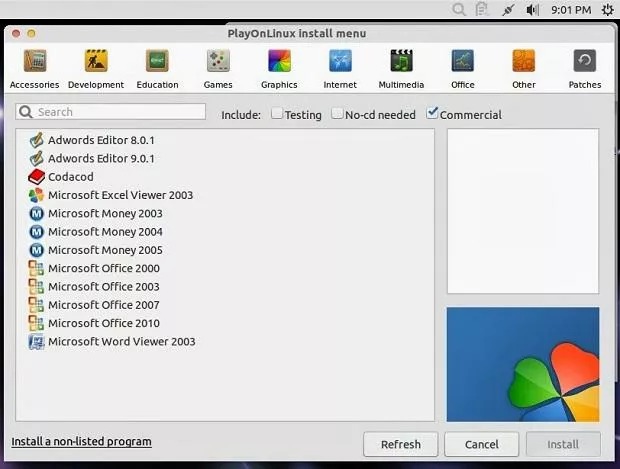

O playonlinux é um programa para instalar programas do Windows no Linux, ele é bastante famoso, pois da pra usar alguns programas do windows no próprio linux, mas as vezes o programa que você ques instalar pode não funcionar, então não fique bravo caso não funcione, porque não é um programa que funciona e instalar qualquer programa do Windows perfeitamente como se fosse no próprio Windows. Para instalar o playonlinux digite:

```bash
sudo apt-get install playonlinux wine winbind p7zip-full
```

Ele vai instalar o playonlinux junto com o wine, que é o o programa que simula a virtualização do Windows no Linux.
</p>


## <p id = "codecs"> Codecs Multimídia


Por questões de legislação, o Ubuntu não pode incluir determinados codecs multimídia, como os de MP3, para poder ser distribuído em alguns países, entre outros formatos. Qualquer pessoa que já formatou o computador com Windows sabe que tem que instalar alguns codecs para que todos os tipos de arquivos rodem no sistema, no Windows é bem comum utilizar o pack “K-Lite”, no Ubuntu, temos o Ubuntu Restricted Extras, ele está na Central de Programas, mas também pode ser baixado pelo terminal:

```bash
sudo apt install ubuntu-restricted-extra
```
</p>

## <p id = "unity-tweak"> Unity Tweak Tool

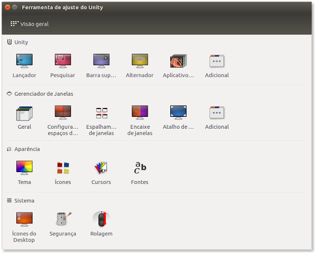

O Unity Tweak Tool é uma das melhores ferramentas para fazer ajustes na interface Unity (se não for a melhor), com ele você conseguirá, inclusive, mover facilmente a barra lateral do Unity para a parte de baixo da tela, que é uma das novidades dessa versão. Para instalar o Unity Tweak Tool digite o comando:

```bash
sudo apt install unity-tweak-tool
```
</p>

## <p id = "gufw"> Gufw
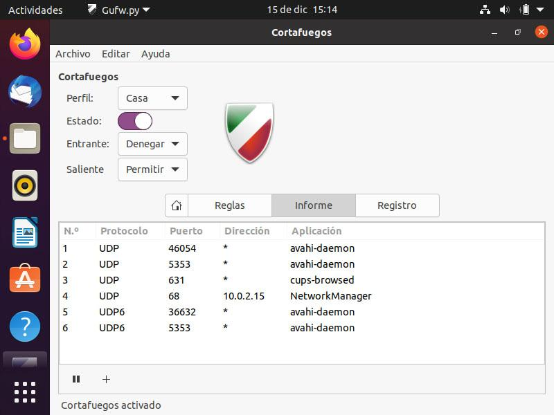

Gufw é o firewall padrão do Ubuntu, Linux. Atua com interface gráfica para o Uncomplicated Firewall (ufw), que roda nas camadas mais básicas do Linux. Sem muitos mistérios e de fácil configuração, o Gufw permite que usuários criem regras, gerenciem perfis de uso para a ferramenta, liguem ou desliguem o firewall, tenham acessos a logs e monitorem o comportamento de aplicativos em tempo real, observando que portas cada um deles acessam para se comunicar com a Internet.

O Gufw facilita o controle do firewall iptables, embutido nas fundações do Linux: sem o Gufw, o controle do firewall teria que ser realizado via linhas de comando que não é exatamente acessível a todos os usuários. Com interface que inspira simplicidade, o Gufw reserva funções e recursos que são suficientes para que o usuário doméstico garanta sua segurança e privacidade enquanto navega pela Internet.

Para instalar o gufw basta digitar:

```bash
sudo apt install gufw
```
</p>

## <p id = "synaptic"> Synaptic


O Synaptic é um programa de computador com uma interface gráfica amigável desenvolvido em GTK+ para o sistema de gerenciamento de pacotes APT, utilizado no Debian GNU/Linux e em outras distribuições que utilizam o APT.

Para instalá-lo basta digitar:

```bash
sudo apt install synaptic
```

</p>

## <p id = "vlc"> VLC


O VLC é um reprodutor de Vídeo e Áudio, sendo usado tanto para reproduzir músicas quanto vídeos.

Para instalar ele, basta digitar:

```bash
sudo apt install vlc
```

</p>

## <p id = "audacious"> Audacious

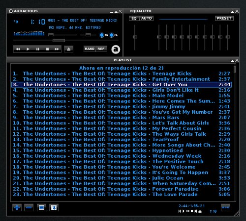

Audacious é um tocador de mídia livre com foco em baixa utilização de recursos, alta qualidade de áudio e suporte a uma ampla variedade de formatos. É desenvolvido primariamente para sistemas POSIX como Linux e unix-like, com suporte limitado ao Microsoft Windows.

Para instalar ele, basta digitar:

```bash
sudo apt install audacious
```

</p>

## <p id = "qbittorrent"> qBittorrent

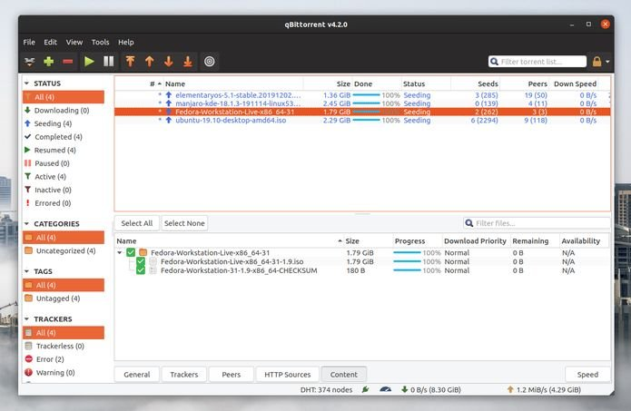

qBittorrent é um aplicativo cliente P2P multiplataforma, gratuito e de código aberto para a rede BitTorrent. O programa utiliza a biblioteca libtorrent-rasterbar para comunicação em rede. qBittorrent está escrito na linguagem de programação C++, também utiliza a biblioteca Qt.

Para quem usa o utorrent mesmo no linux, pode usar o qBittorrent no linux. 
Para instalar ele, basta digitar:

```bash
sudo apt install qbittorrent
```
</p>

## <p id = "flameshot"> Flameshot

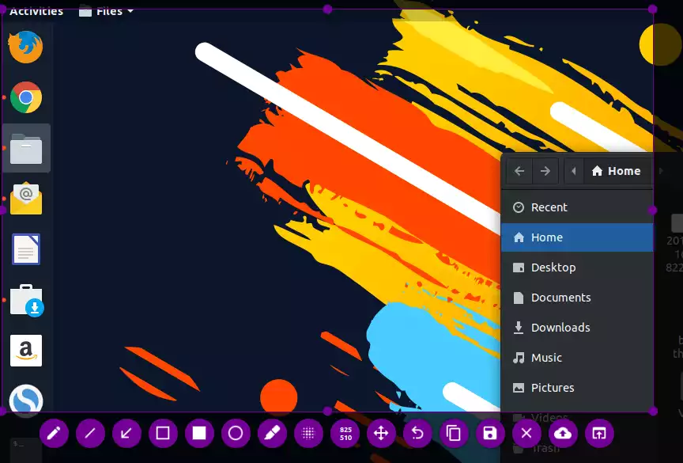

Conheça o melhor app de captura de telas para Linux. Acredite, capturar telas no Linux vai ser uma tarefa simples com esta ferramenta open source. Flameshot possui um conjunto útil de ferramentas de marcação e seleção, incluindo desenho à mão livre, linhas, setas, caixas, círculos, realces, desfoque.

Para instalar ele, basta digitar:

```bash
sudo apt install flameshot
```

É bem provável que após instalá-lo, você vai procurar e clicar no ícone do aplicativo, e bem provável também que não vai acontecer nada, mas não fique chateado, pois para ele funcionar digite o seguinte comando no terminal:

```bash
flameshot gui
```

Se aparecer uma tela meio escura e uma mensagem explicando como usar o flameshot, é porque funcionou, ele é bem parecido com o lighshot pra quem usa o Windows, e ainda tem algumas ferramentas a mais, você pode adicionar um atalho de teclado para ele simplesmende indo em configurações > teclado > atalhos personalizados, e depois so clicar em "+", e colocar um nome para saber o atalho que é, e o comando colocar "flameshot gui", sem as aspas, igual colocou no terminal e depois colocar um atalho, se quiser pode colocar o botão PRTSC e substituir o salvamento padrão dos prints do linux.

Se você quiser também entrar nas configurações do flameshot, basta digitar:

```bash
flameshot config
```
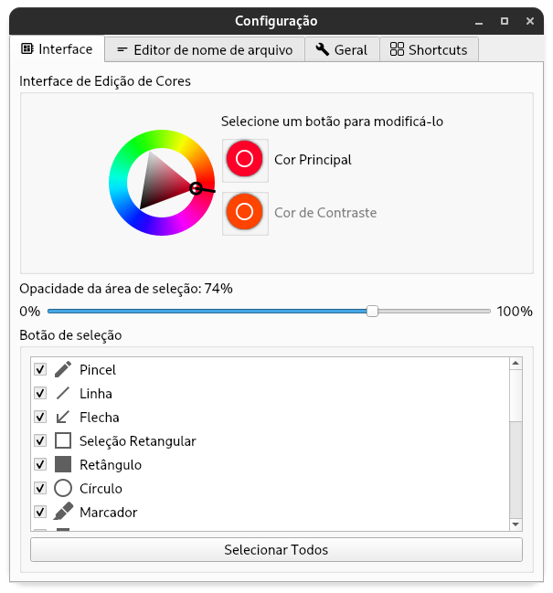

Ele vai abrir essa tela de configurção do flameshot.

</p>

## <p id = "gParted"> GParted

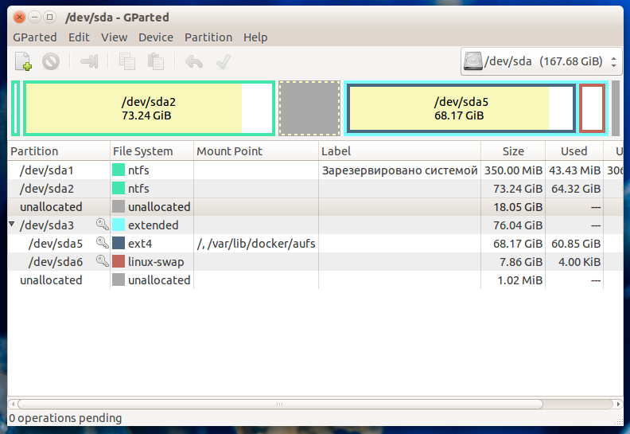

GParted (ou Gnome Partition Editor) é o aplicativo GNOME para edição de partições. ... É usado para criar espaço para novos sistemas operacionais (operativos em Portugal), reorganizar o uso do disco rígido, copiar dados e "espelhar" uma partição em outra.

```bash
sudo apt install gparted
```
</p>

<p id = "font-manager">

## Font Manager

O software de gerenciamento de fontes é um utilitário que os usuários de computador usam para procurar e visualizar fontes e geralmente para instalar e desinstalar fontes. Além disso, dependendo dos recursos do programa de gerenciamento de fontes individuais, os usuários também podem: ativar e desativar fontes.

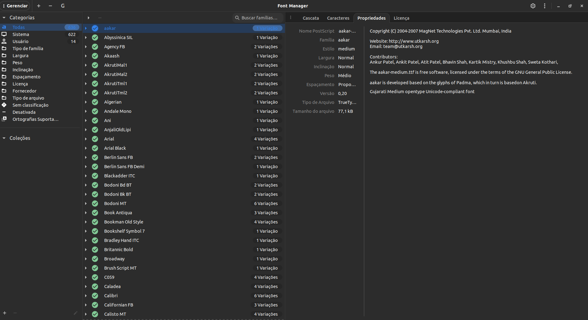

A versão mais recente do font manager(0.8) tem suporte ao Google Fontes, que facilita muito na hora de instalar uma fonte pelo Google Fontes, pois é so escolher a opção do Google, com o símbolo do "G", e colocar o nome da fonte que deseja instalar.

Para instalar a versão mais recente do fonte manager no Ubuntu, você pode usar o PPA  para instalar a versão mais recente no Ubuntu 20.04 LTS e superior:

```bash
sudo add-apt-repository ppa:font-manager/staging
```

```bash
sudo apt install font-manager
```

Depois de instalado, basta iniciar o aplicativo no menu. A primeira vez que você executa o aplicativo, pode levar alguns segundos para detectar e exibir suas fontes, especialmente se você tiver muitas instaladas.

</p>

## <p id = "obs-studio"> Obs Studio

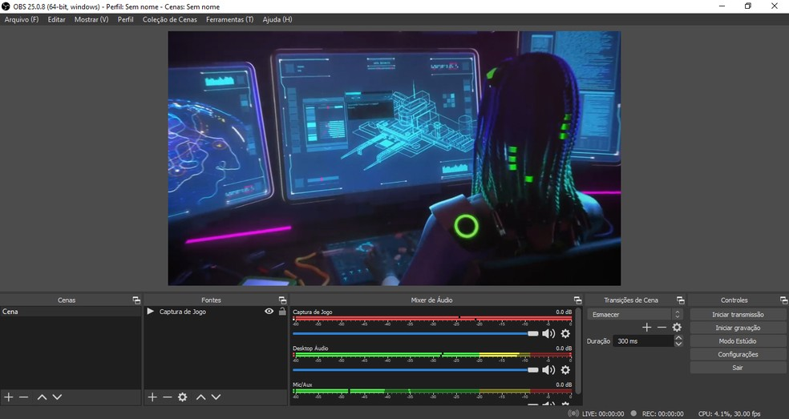

O OBS é uma suíte de software gratuita e de código aberto para gravação e transmissão ao vivo. Escrito em C e C ++, o OBS fornece captura de fonte e dispositivo em tempo real, composição de cena, codificação, gravação e transmissão. ... O áudio pode ser codificado usando os codecs MP3 ou AAC.

Para instalá-lo basta digitar:

```bash
sudo apt install obs-studio
```
</p>

## <p id = "alacarte"> Alacarte
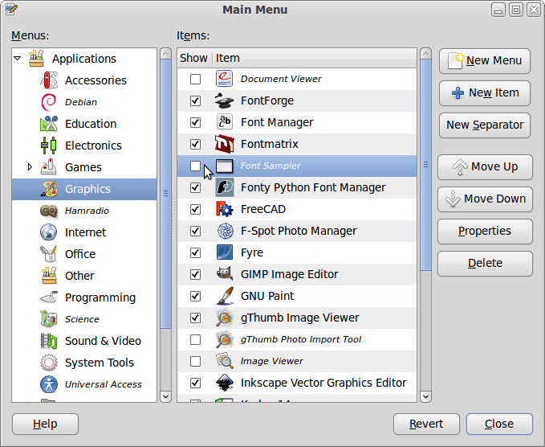

Talvez você não conhece o nome Alacarte ( que é o nome real do programa ) mas conheça descrição dele, editor de Menu Principal.

Com ele você pode editar os menus do Ubuntu e do Linux Mint, o próprio Mint traz essa ferramenta com o sistema, onde você pode acrescentar itens, remover itens, exibir ou ocultar programas e categorias, trocar os ícones dos programas, trocar o endereço do executável, etc.

Para instalar basta digitar:

```bash
sudo apt install alacarte
```
</p>

## <p id = "blender" > Blender

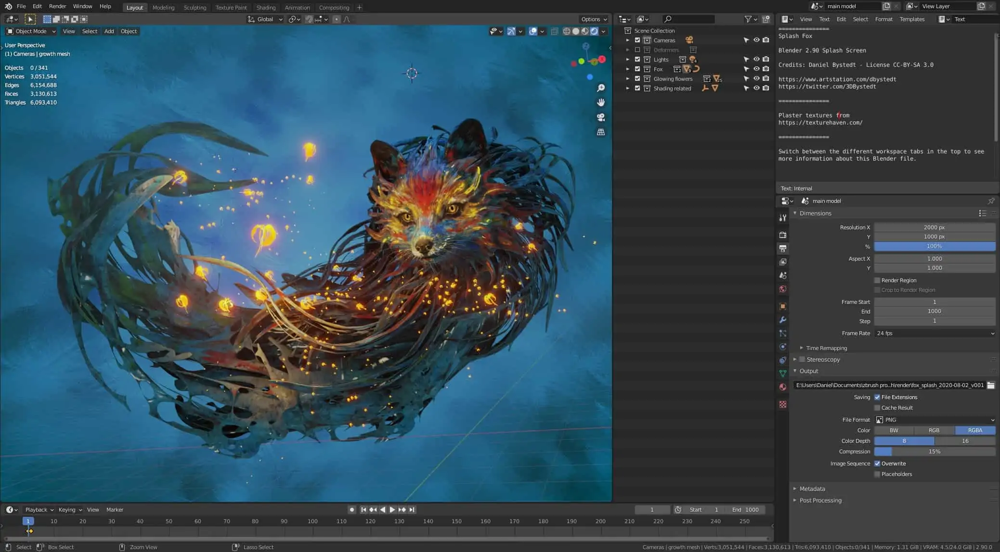

Blender, também conhecido como blender3d, é um programa de computador de código aberto, desenvolvido pela Blender Foundation, para modelagem, animação, texturização, composição, renderização, e edição de vídeo. Está disponível sob a GNU GPL, versão 2 ou posterior.

Para instalá-lo basta digitar:

```bash
sudo apt install blender
```

## <p id = "gimp"> Gimp

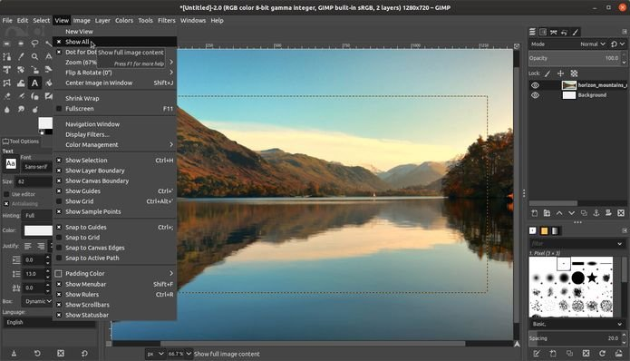

GIMP é um programa de edição e criação de imagens para Windows, Mac e Linux. Ele é uma boa alternativa gratuita ao Photoshop e conta com uma série de ferramentas e recursos, como pincéis e efeitos para fotografias. O editor ganhou interface única, permitindo ao usuário abrir várias janelas distintas.

Para instalá-lo basta digitar:

```bash
sudo apt install gimp
```
</p>

## <p id = "krita"> Krita

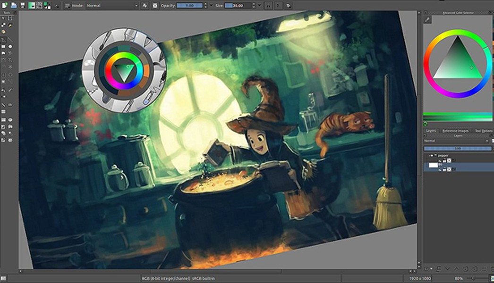

Krita é uma ferramenta de criação de ilustrações, concept art, histórias em quadrinhos, pinturas digitais, animações, possibilitando também ser usado como um programa de retoques e manipulação de fotografia, conversor de formatos, suportando vários modelos de cores e pintura HDR. Ele é também uma alternativa ao Gimp, mas você pode usar os dois se quiser.

Para instalá-lo basta digitar:

```bash
sudo apt install krita
```
</p>

## <p id = "inkscape"> Inkscape

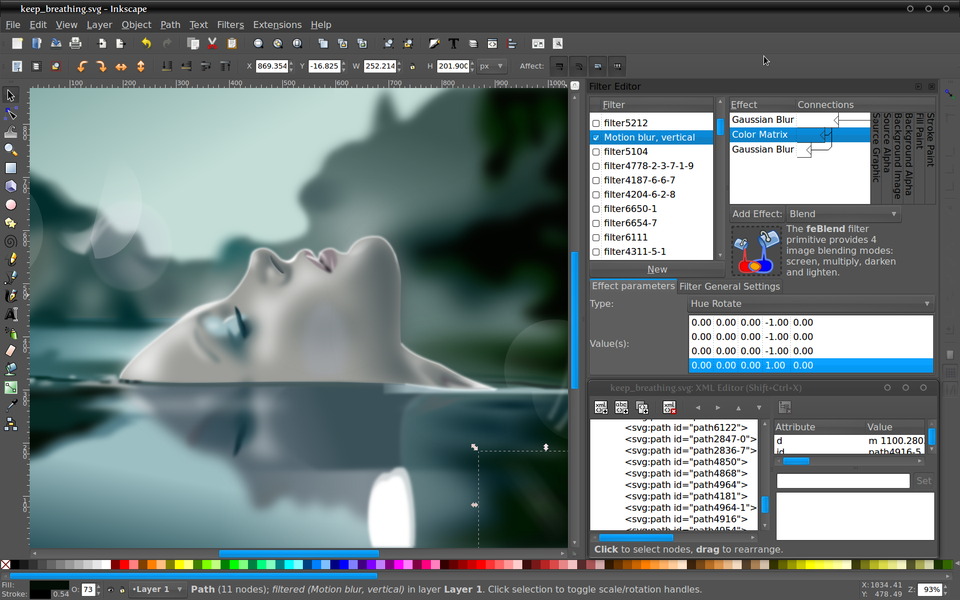

Inkscape é um software livre para editoração eletrônica de imagens e documentos vetoriais, com base numa versão mais avançada do antigo Sodipodi no qual teve origem. Trata-se assim de um fork considerado de sucesso.

Para instalá-lo basta digitar:

```bash
sudo apt install inkscape
```
</p>

## <p id = "steam"> Steam

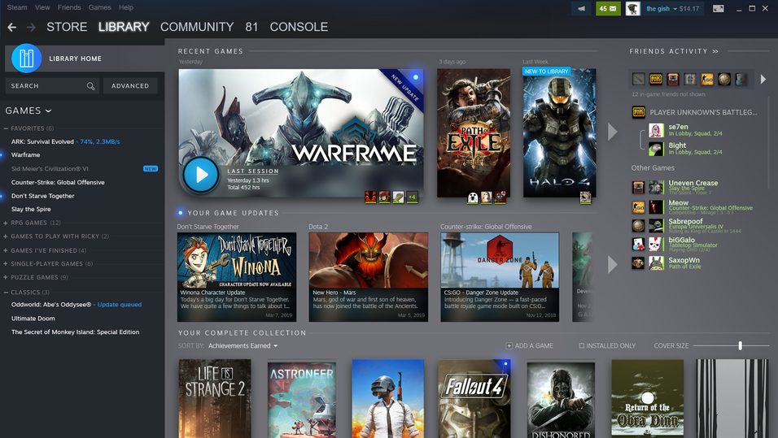

Steam é um software de gestão de direitos digitais criado pela Valve Corporation ou Valve L.L.C., de plataformas digitais como jogos e aplicativos de programação e fornece serviços facilitados como atualização automática de jogos, e preços acessíveis aos usuários.

Sabia que tem Steam para Linux? Isso mesmo. A famosa Steam também está neste sistema. Para quem dizia que não haviam jogos para Linux, estavam enganados. 

Para instalá-lo basta digitar:

```bash
sudo apt install steam
```

Mas infelizmente tem poucos jogos nativos para Linux comparado com o que tem para o Windows

</p>

## <p id = "lutris"> Lutris


Lutris é um gestor de jogos livre e de código aberto para sistemas operacionais baseados em Linux, desenvolvido e mantido por Mathieu Comandon e pela comunidade,listado sob a Licença Pública Geral GNU. O Lutris possibilita a instalação de diversos jogos a partir de seu site, com um único clique, e também se integra ao site do Steam. Scripts de instalação estão disponíveis para alguns jogos difíceis de ser executados na plataforma, que rodam por meio da camada WINE, como o popular League of Legends. Jogos adquiridos por meio da GOG e da Humble Bundle podem ser adicionados por meio de seus próprios lançadores no Lutris. Os jogos são executados em suas respectivas plataformas, como WINE, Steam e emuladores, e podem ser iniciados com a mediação do aplicativo Lutris. Mais de 20 emuladores são suportados, incluindo DOSbox, ScummVM, Atari 800, Snes9x, Dolphin, PCSX2 e PPSSPP.

Para instalá-lo primeiramente adicione o PPA do Lutris no seu Ubuntu com o comando abaixo:

```bash
sudo add-apt-repository ppa:lutris-team/lutris
```
Agora atualize os repositórios da sua distro com o comando abaixo:

```bash
sudo apt-get update
```
E por último, instale o Lutris com o comando:

```bash
sudo apt-get install lutris
```

</p>

## <p id = "winff"> Winff

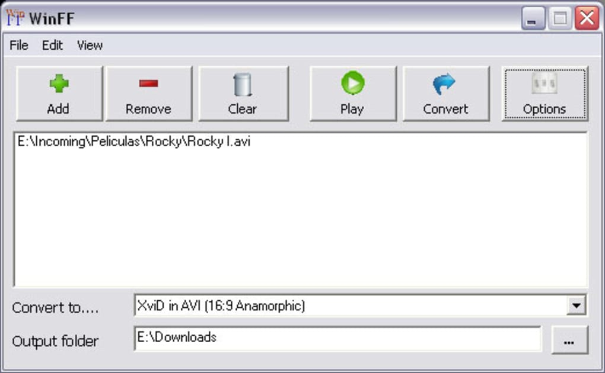

WinFF possibilita que os usuários interajam com FFmpeg utilizando os botões , menus, campos de formulários e listas em vez de usar a linha de comando. A tela padrão permite aos usuários criar uma lista de arquivos para a conversão e para especificar configurações diferentes para cada arquivo. WinFF pode reproduzir arquivos em fila e visualizar as configurações de conversão diferentes , lançando ffplay , um media player baseado em FFmpeg que vem com o programa. WinFF pode transcodificar entre qualquer um dos formatos de vídeo na biblioteca libavformat multimídia, incluindo MPEG, H.261 cru, H.263 e H.264 , PMP , AVI e MOV. WinFF está disponível para Windows e Linux.

Para instalá-lo basta digitar:

```bash
sudo apt install winff
```
</p>

## <p id = "ranger"> Ranger

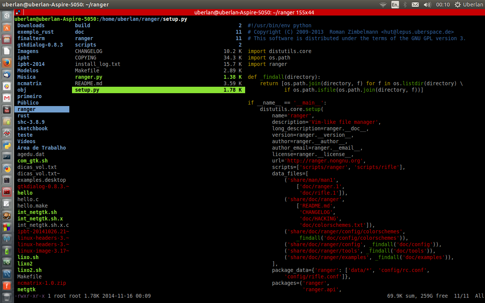

O Ranger é um gestor de arquivos de linha de comando (CLI), escrito em Python. O programa possui todas as funções presentes nos gestores mais usados, como o Nautilus, no Ubuntu.

```bash
sudo apt install ranger
```
</p>

## <p id = "ncdu"> NCDU

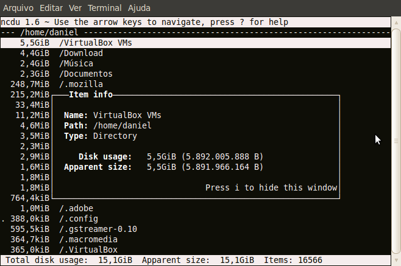

Ncdu é uma utilitário de comando de linha, que ajudará a avaliar o espaço em disco no UNIX e distribuições LINUX. Ncdu é um analisador de uso de disco com uma interface ncurses que pode ser utilizada principalmente em terminais texto.

Para instalá-lo basta digitar:

```bash
sudo apt install ncdu
```
</p>

## <p id = "neofetch"> Neofetch

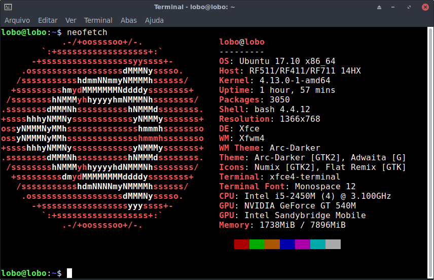

Neofetch é uma ferramenta desenvolvida para criar protetores de tela de console que mostram informações sobre o sistema, hardware e software.

Para instalá-lo basta digitar:

```bash
sudo apt install neofetch
```
</p>

## <p id = "screenfetch"> Screenfetch

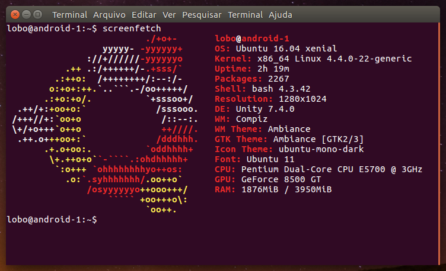

screenFetch: Informações do sistema e algumas firulas via terminal. screenFetch é um script que desenha a logo da sua distribuição em formato ASCII no terminal, trazendo também as informações básicas do computador, como por exemplo, sistema operacional, Kernel, processador, memoria ram e etc.

Para instalá-lo basta digitar:

```bash
sudo apt install screenfetch
```
</p>

## <p id = "libreoffice"> Libre Office

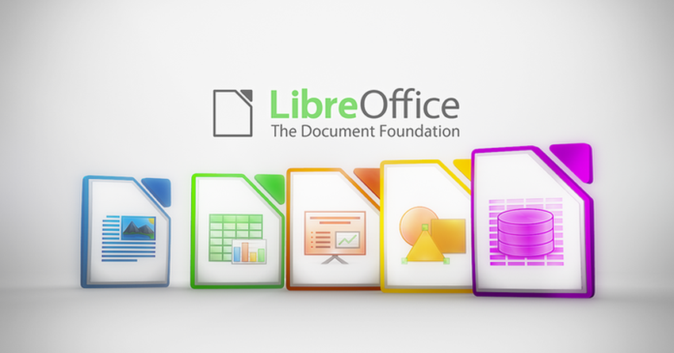


O LibreOffice é um pacote de programas para uso profissional ou pessoal. O serviço traz opções para criar e editar textos, tabelas, apresentações, desenhos, fórmulas matemáticas e até organizar um banco de dados. Ele é uma alternativa do Microsoft Office, e é gratuito.

Se você fez a instalação mínima no Ubuntu e você quer instalar todo o pacote LibreOffice, basta digitar:

```bash
sudo apt-get install libreoffice
```

Se você quiser instalar apenas algum em específico como o LibreOffice Writer(Parecido com o Word), ou o LibreOffice Calc(Parecido com o Excel), ou o LibreOffice Impres(Parecido com o PowerPoint), basta digitar:

LibreOffice Writer:

```bash
sudo apt-get install libreoffice-writer
```

LibreOffice Calc:

```bash
sudo apt-get install libreoffice-calc
```

LibreOffice Impress:

```bash
sudo apt-get install libreoffice-impress
```

Caso deseja remvoer algum dos LibreOffice, como por exemplo o LibreOffice Impress, basta digitar:

```bash
sudo apt-get --purge remove libreoffice-impress
```

Ou basta colocar o nome de qual você quer remover no lugar do "impress".

</p>

<p id = "onlyoffice">

## OnlyOffice

"OnlyOffice", estilizado como "ONLYOFFICE", é uma suíte de escritório de código aberto desenvolvida pela Ascensio System SIA, uma empresa com sede em Riga, Letônia. Ele é uma ótima alternativa do Microsoft Office, e tem tanto para Linux, Windows e MacOS, e para instalar ele basta acessar o site oficial e baixar a versão de acordo com a sua distro Linux:

<a href="https://www.onlyoffice.com/pt/desktop.aspx">OnlyOffice</a>.

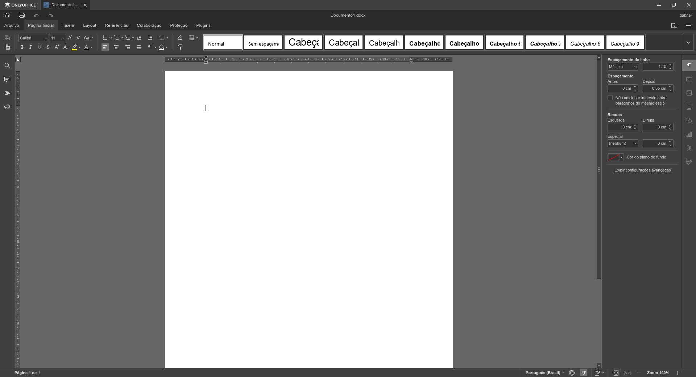


</p>

## Remover programas

Para remover qualquer um dos programas que listamos anteriormente(exceto o LibreOffice que já está explicado como remover algum dos pacotes offices), é bem simples também, basta digitar:

```bash
sudo apt remove nomedoprograma
```

Exemplo:

```bash
sudo apt remove gimp
```

Ele vai remover o editor de imagens Gimp. Bem fácil não é?

<p id = "arquivos.">
E caso você tenha se perguntado, "E para instalar o Google Chrome?" ou o Discord, ou qualquer outro programa famoso que não está nessa lista, é bem simples, porque alguns programas não fica junto de outros programas do gerenciador de pacotes do Ubuntu/Debian, e para instalar esse programas é bem simples, digamos que você queira instalar o Google Chrome, o mais querido navegador de todos(e ao mesmo tempo "odiado" por usar muita memória RAM), para isso basta você pesquisar no navegador que veio como padrão no Ubuntu/Debian(normalmente é o FireFox), "download Chrome" ou "Download Google Chrome", e vai aparecer alguns links de opções para você entrar e baixar, assim como você faria no Windows.


Clicando na página "Navegador da Web Google Chrome", vai entrar na seguinte tela:


Igual no Windows mesmo, clicando no botão de "Fazer o download do Google Chrome", vai aparecer outra janela pedindo pra você escolher o formato da extensão do arquivo:

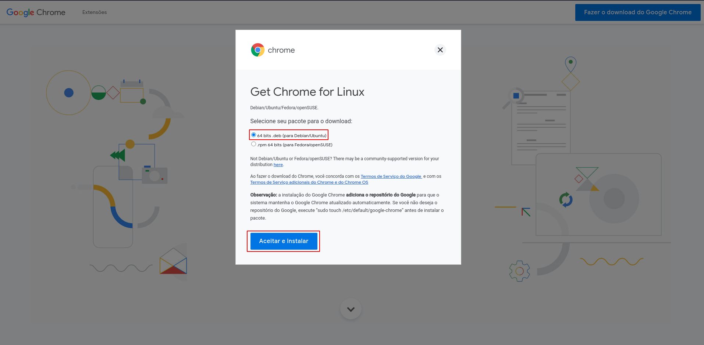

Se você estiver usando o Ubuntu, Debian, Linux Mint ou qualquer outra distro baseada no Ubuntu ou Debian, sempre baixe o formato ".deb", que é o padrão de extensão para distros baseadas no Debian, depois de ter baixado, ele vai gerar um arquivo como esse:

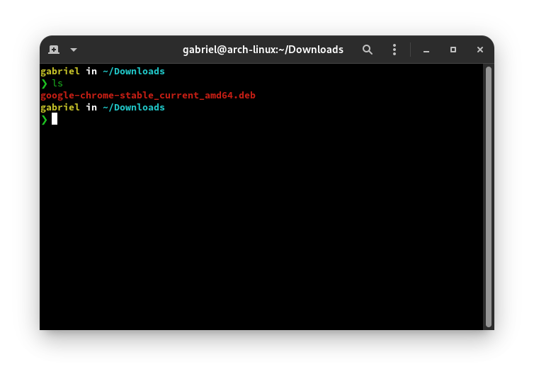

Os arquivos ".rpm" são para as distros que usam o RPMFusion como gerenciador de arquivos e programas, como o Fedora, RedHat, OpenSuse, etc.

Para instalá-lo é bem simples, ou você pode dar um duplo clique no arquivo que ele vai abrir a lojinha do Linux e é so você clicar em "instalar", ou pode fazer isso pelo terminal. Para instalar pelo terminal é bem simples, basta digitar:

```bash
sudo dpkg -i nomedoarquivo.deb
```

Exemplo:

```bash
sudo dpkg -i google-chrome-stable_current_amd64.deb
```

O "-i" é o "install" do gerenciador de pacotes ".deb" do dpkg, assim como o "install" para o "apt".

Ou

```bash
sudo apt install ./nomedoarquivo.deb
```

Exemplo:

```bash
sudo apt install ./google-chrome-stable_current_amd64.deb
```

E depois que o comando terminar de rodar, ele vai ter instalado o Google Chrome, depois disso é só abrir e usar ele como qualquer outro programa, e você pode fazer isso pra instalar o Discord, ou qualquer outro programa com a extensão ".deb".


E se você quiser remover algum programa com a extensão ".deb" que você tenha instalado, basta digitar:

```bash
sudo dpkg -r nomedoprograma
```

Exemplo:

```bash
sudo dpkg -r google-chrome
```

O "-r" é referente ao "remove" do apt, e colocando apenas o nome que o sistema reconhece o programa já vai removê-lo, eu prefiro usar o "sudo apt install ./nomedoarquivo.deb", pois além de ser mais fácil de lembrar quando se está iniciando, ele da menos problemas de pacotes quebrados comparado ao "dpkg -i".

</p>

Caso você tenha algum problema com pacotes quebrados, tem como resolver essas dependências. Para fazer isso, é necessário listar os pacotes quebrados no Ubuntu e, em seguida, os usuários do Ubuntu podem consertar os pacotes quebrados via linha de comando. Se uma instalação de pacote falhar no Linux Ubuntu, isso pode causar alguns problemas.

Por exemplo, o gerenciador de pacotes congela ou fica bloqueado. É um problema usar o Ubuntu corretamente enquanto os pacotes do sistema estão quebrados. Felizmente, existem algumas maneiras de resolver o problema.

Se você souber o nome do pacote quebrado, poderá removê-lo manualmente usando o seguinte comando.

```bash
sudo dpkg –remove -force –force-remove-reinstreq NOME_DO_PACOTE_VAI_AQUI
```

Exemplo:

```bash
sudo dpkg –remove -force –force-remove-reinstreq google-chrome
```

Se você não tiver certeza sobre o nome do pacote quebrado, siga os comandos abaixo:

### Comando 1

```bash
sudo apt-get –fix-broken install
```

### Comando 2

Se uma instalação do pacote do Ubuntu falhar (devido às dependências), execute os seguintes comando:

```bash
sudo apt-get clean
```

```bash
sudo apt-get install -f
```

```bash
sudo dpkg –configure -a
```

### Comando 3

```bash
sudo rm /var/lib/apt/lists/* -vf
```

```bash
sudo apt-get update
```

### Comando 4

```bash
sudo apt-get clean
```

```bash
sudo apt-get autoclean
```

```bash
sudo apt-get autoremove
```

### Comando 5

```bash
sudo dpkg –configure -a
```

```bash
sudo apt-get update
```
### Conclusão

Espero que uma dessas correções tenham funcionado para você e que o sistema volte a trabalhar normalmente. Lembre-se que a melhor maneira de lidar com uma situação totalmente é tentar voltar ao que era antes.

## OBS:. Tente não instalar novos pacotes pensando em resolver uma quebra no Ubuntu, a menos que você saiba exatamente o que está fazendo. É provável que você acabe com um emaranhado de coisas quebradas que serão mais difíceis de resolver.

Agora basta aproveitar e usufruir o Ubuntu da melhor maneira que você puder. Caso, venha acontecer novamente este problema, basta recorrer novamente aos comandos aqui listados.

Essas informações foram tiradas do site <a href = "https://sempreupdate.com.br/como-corrigir-pacotes-quebrados-no-ubuntu/"> SempreUpdate</a>.

## Mudar o Terminal

Se você instalou algum outro terminal no linux e quer mudar o terminal, ou quer voltar para o terminal padrão(gnome-terminal), caso o que tenha sido instalado mudou para ele automaticamente, basta digitar:

```bash
sudo update-alternatives --config x-terminal-emulator
```

Vai aparecer uma lista com todos os terminais instalados, e basta selecionar qual você quer.
</p>

***

<p id = "fedora">


Fedora (conhecido como Fedora Core antes da versão 7) é um sistema operacional (pt-BR) ou sistema operativo (pt-PT) Linux. O sistema operacional Fedora Linux é software livre e de código aberto, e os programas disponíveis dentro de seu repositório de programas também são programas livres que aderem a uma licença livre.

O Fedora Linux existe desde 2003, e seu desenvolvimento e suporte é oferecido pela comunidade do Projeto Fedora. Após ter descontinuado o sistema operacional Red Hat Linux, a Red Hat patrocina o desenvolvimento do sistema operacional Fedora, se envolvendo no desenvolvimento de vários programas disponíveis para o Fedora, que são eventualmente adicionados para o repositório do Red Hat Enterprise Linux, que é a distribuição Linux atual da empresa.

Desde a versão Fedora 21, há três edições disponíveis: Fedora Workstation, focado para computadores pessoais, Fedora Server para servidores, e o Fedora Cloud para servidores com foco em computação em nuvem. Também existem outras edições, chamadas de "spins", com ambientes gráficos diferentes do ambiente gráfico GNOME que acompanha o sistema operacional. Ambientes gráficos como o KDE, Xfce, LXDE, entre outros, estão disponíveis. Também existem edições para usos específicos, como o uso para computação científica, astronomia, robótica, segurança e para jogos. Novas versões do Fedora são lançadas aproximadamente a cada 6 meses.

Da mesma forma que no Ubuntu/Debian ou qualquer outra distro Linux, devemos sempre atualizar o sistema antes de instalar qualquer programa, e para atualizar o Fedora basta digitar:

```bash
sudo dnf update -y
```

Assim como o "apt" é o gerenciador de pacotes do Ubuntu, o "dnf" é o gerenciador de pacotes do Fedora. Depois de atualizar o sistema, você sempre precisar reiniciar o computador. Se deseja verificar se tem mais alguma atualização no Fedora, basta digitar:

```bash
dnf check-update
```
ou

```bash
dnf list updates
```

E ele vai listar os programas que precisam ser atualizados, se aparecer apenas "Ultima verificação dia 14/07/2021 as 16:45:52" por exemplo, é porque não tem atualização, mas se aparecer um tanto de programas(provavelmente escritos em verde), é so rodar o comandos citados anteriormente para atualizar o sistema.

# RPM Fusion

Depois de ter atualizado o sistema, a segunda coisa a se fazer é instalar o RPMFusion Free e NonFree.

RPM Fusion é um repositório de software, que proporciona pacotes adicionais para a distribuição GNU/Linux Fedora. Naseu da fusão dos antigos repositórios Livna, Dribble y Freshrpms. Distribuíam softwares que não são aceitos pelo Fedora, seja por não cumprirem os requisitos de software livre do Fedora, ou porque eles pudessem violar leis nos Estados Unidos.

RPM Fusion se divide em dois repositórios de software separados em termos de licença:

## Free

Softwares de código aberto, que a equipe do Fedora não pode incluir nos repositórios do projeto por questões que não envolvem licenciamento.

## Nonfree

Softwares redistribuíveis que não sejam de código aberto, o que inclui software com código-fonte disponível publicamente e sem restrições similares às de "uso comercial".

Para instalar o RPM Fusion, basta entrar no site oficial do <a href = "https://rpmfusion.org/Configuration"> RPMFusion.org </a> para fazer o download do RMPFUsion Free e NonFree. Basta você baixar os arquivos "RPM Fusion free for Fedora 34" e "RPM Fusion nonfree for Fedora 34", no caso o "34" é a versão atual do Fedora atualmente, então quando for baixar, baixe a versão atual do seu Fedora.

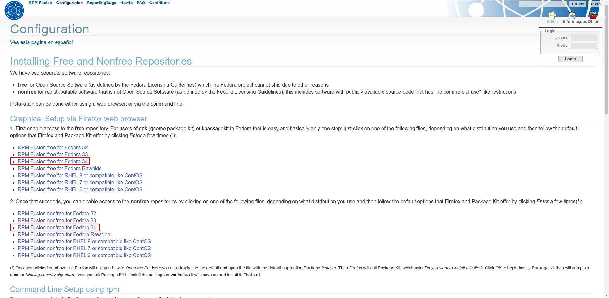

Ele vai baixar arquivos como esse:

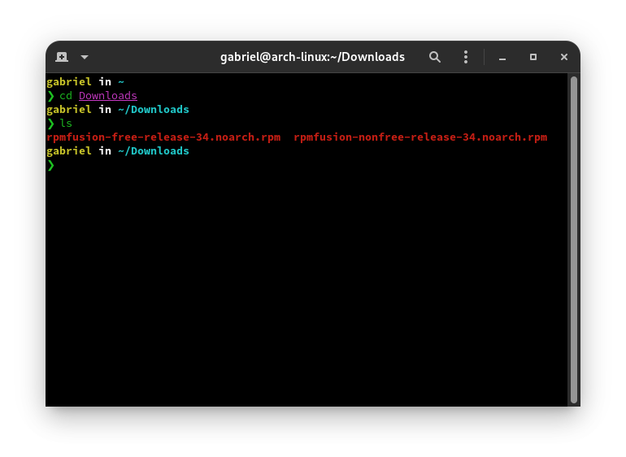

Para instalar basta digitar:

```  bash
sudo dnf install rpmfusion-free-release-34.noarch.rpm
```

 E

```bash
sudo dnf install rpmfusion-nonfree-release-34.noarch.rpm
```

Ou pode instalar os dois juntos digitando:

```bash
sudo dnf install rpmfusion-free-release-34.noarch.rpm install rpmfusion-nonfree-release-34.noarch.rpm
```

Ele vai instalar os dois juntos o RPM Fusion Free e o RPM Fusion NonFree. Depois de ter instalado o RPM Fusion ele vai ter sincronizado com todos os pacotes do RPM Fusion, e vai facilitar muito para instalar alguns programas no Fedora.

# Agora vamos colocar aqui uma lista de alguns programas que você possa se interessar:

Para não ficar repetitivo a explicações de alguns programas que colocamos no Ubuntu também, vou apenas colocar o nome do programa e o comando para instalar, e depois uma linkagem para se você quiser saber sobre o programa, basta clicar no nome.

## <a href = "#playonlinux">  Playonlinux </a>

Para instalar o playonlinux no Fedora, basta digitar:

```bash
sudo dnf install playonlinux wine
```

Ele vai instalar o Playonlinux e o Wine juntos.

## <a href = "#vlc"> VLC </a>

```bash
sudo dnf install vlc
```

## <a href = "#audacious"> Audacious </a>

```bash
sudo dnf install audacious
```

## <a href = "#qbittorrent"> qBittorrent </a>

```bash
sudo dnf install qbittorrent
```

## <a href="#font-manager">Font Manager</a>

``` bash
sudo dnf install font-manager
```

## <a href = "#flameshot"> Flameshot </a>

```bash
sudo dnf install flameshot
```

## <a href = "#gParted"> GParted </a>

```bash
sudo dnf install gparted
```

## <a href = "#obs-stido"> Obs Studio </a>

```bash
sudo dnf install obs-studio
```

## <a href = "#alacarte"> Alacarte </a>

```bash
sudo dnf install alacarte
```

## <a href = "#gimp"> Gimp </a>

```bash
sudo dnf install gimp
```

## <a href = "#krita"> Krita </a>

```bash
sudo dnf install krita
```

## <a href = "#inkscape"> Inkscape </a>

```bash
sudo dnf install inkscape
```

## <a href = "#steam"> Steam </a>

```bash
sudo dnf install steam
```

## <p id = "discord" > Discord


Discord é um aplicativo de voz sobre IP proprietário e gratuito, projetado inicialmente para comunidades de jogos. O aplicativo Discord está disponível para os sistemas operacionais Microsoft Windows, MacOS, Android, iOS, Linux e em navegadores da Web.

Diferente do Ubuntu que precisa baixar o Discord do site oficial com a extensão ".deb", o Fedora já não tem uma versão ".rpm" do Discord, e para instalar é bem simples, basta digitar:

``` bash
sudo dnf install discord
```

Caso você tente compartilhar a tela no Discord ou qualquer outro programa/site de reunião, e ficar apenas uma tela preta com o mouse, sem mostrar nenhum programa aberto ou mesmo a área de trabalho, vamo editar o arquivo "/etc/gdm/custom.conf":

```bash
sudo gedit /etc/gdm/custom.conf
```

Ele vai abrir o editor de texto padrão do Linux o Gedit, e dentro do arquivo vai ter o seguinte conteúdo:

```bash
# GDM configuration storage

[daemon]
# Uncomment the line below to force the login screen to use Xorg
#WaylandEnable=false

[security]

[xdmcp]

[chooser]

[debug]
# Uncomment the line below to turn on debugging
#Enable=true
```

Substitua pelo seguinte conteúdo:

```bash
# GDM configuration storage

[daemon]
# Uncomment the line below to force the login screen to use Xorg
WaylandEnable=false
DefaultSession=gnome-xorg.desktop

[security]

[xdmcp]

[chooser]

[debug]
# Uncomment the line below to turn on debugging
#Enable=true
```

Depois de ter substituído o conteúdo, clique em salvar, ou aperte "Ctrl + S" para salvar o arquivo, de pode fechar o gedit, depois disso basta reiniciar o computador e já vai estar funcionando o compartilhamento de tela perfeitamente.

</p>

## <a href=#blender> Blender</a>

``` bash
sudo dnf install blender
```

</p>

## <a href = "#lutris"> Lutris </a>

```bash
sudo dnf install lutris
```

## <a href = "#ranger"> Ranger </a>

```bash
sudo dnf install ranger
```

## <a href = "#ncdu"> NCDU </a>

```bash
sudo dnf install ncdu
```

## <a href = "#neofetch"> Neofetch </a>

```bash
sudo dnf install neofetch
```

## <a href = "#screenfetch"> Screenfetch </a>

```bash
sudo dnf install screenfetch
```

O pacote Libre Office já vem instalado  por padrão no Fedora.

Para instalar o Google Chrome ou qualquer programa que tenha a extensão ".rpm", basta fazer o mesmo citado na <a href = "arquivo."> instação </a> feita no Ubuntu, só que ao invés de baixar o ".deb" baixe o ".rmp", e para instalar ele basta digitar:

```bash
sudo dnf install google-chrome-stable_current_amd64.rpm
```

Você pode fazer isso para qualquer arquivo ".rpm", basta colocar o nome completo do arquivo no lugar do "google-chrome-stable_current_amd64.rpm".

E para remover um programa do Fedora, basta digitar:

```bash
sudo dnf remove nomedoprograma
```

Exemplo:

```bash
sudo dnf remove google-chrome
```

</p>

***
<p id = "arch-linux">
 

Arch Linux, ou Arch é uma distribuição Linux para computadores com arquitetura x86-64. Desenvolvido inicialmente pelo canadense Judd Vinet, esse sistema operacional se apresenta de maneira diferente de outros, como Windows e MacOS. Além de ser composto predominantemente por software livre e de código aberto, ele envolve contribuições da comunidade.

O desenvolvimento é focado na elegância, minimalismo e simplicidade no código, e espera que o usuário faça alguns esforços para compreender o modo de funcionamento do sistema. O gerenciador de pacotes, Pacman, foi escrito especialmente para o Arch Linux e é usado para instalar, remover, pesquisar e atualizar os pacotes do sistema.

O Arch Linux usa o modelo rolling release. Com esse sistema, os usuários podem ter acesso às últimas atualizações estáveis dos pacotes e também evita atualizações muito grandes que podem gerar erros nos componentes do sistema. As imagens de instalação lançadas pela equipe do Arch são apenas capturas instantâneas de imagens de disco atualizadas dos principais componentes do sistema.

Usuários da distribuição podem criar facilmente seus próprios pacotes compatíveis com o pacman usando ferramentas como o "Arch Build System", funcionalidade esta que ajudou a sustentar o AUR, um repositório de pacotes criados por usuários que complementam os repositórios oficiais.

O Arch seria uma distro Linux mais "Hardcore" digamos, pois para você instalar ele, você mesmo tem que "criar" o sistema, instalar tudo por linhas de comando, não é que nem outras distros como o Ubuntu ou Fedora ou muitas outras que tem uns instalador pronto, que você apenas define coisas básicas do sistema como região, idioma, teclado, nome de usuário e so clicar em instalar, você mesmo tem que reparticionar o disco até mesmo chegara instalar a interface gráfica dele. No caso do Manjaro Linux que tem umas instalação simples como as outras distros, e é baseado no kernel do Arch, usando o mesmo gerenciador de pacotes o "pacman", então se você quer instalar o Arch Linux, o recomendado  é que você tenha um pouco de conhecimento em Linux, pode começar por qualquer distro como o Ubuntu, Linux Mint, Debian, Fedora, popOS, entre outros. O mais recomendado para quem está entrando no mundo Linux é que comece pela distro Ubuntu ou Linux Mint, ou qualquer outra distro baseada no Ubuntu, pois terá uma interface mais "amigável", com fácil aprendizado.

E se você quer ir por mundo do Arch, mas não quer ir sem saber nada de como funciona, pode tentar primeiro o Manjaro, já que o mesmo tem uma instalação bem simples.

Da mesma forma que no Ubuntu/Debian ou qualquer outra distro Linux, devemos sempre atualizar o sistema antes de instalar qualquer programa, e para atualizar o Arch Linux/Manjaro basta digitar:


```bash
sudo pacman -Sy
```

ou

```bash
sudo pacman -Syyu
```

Para fazer sincronização total com os pacotes e fontes do Arch, e atualizar tudo que precisar.


O "pacman" é o gerenciador de pacotes do Arch/Manjaro, e o "-S" é para instalar algum pacote, e o "-Sy" para sincronizar com as fontes de instalação do Arch e verificar se tem alguma atualização, se tiver atualização, ele vai perguntar se você deseja atualizar ou não o sistema como no Ubuntu ou Fedora.

Para verificar se tem alguma atualização no Arch, basta digitar:

```bash
sudo pacman -Qu
```

# Agora vamos colocar aqui uma lista de alguns programas que você possa se interessar:

Para não ficar repetitivo a explicações de alguns programas que colocamos no Ubuntu ou Fedora também, vou apenas colocar o nome do programa e o comando para instalar, e depois uma linkagem para se você quiser saber sobre o programa, basta clicar no nome.

## <a href = "#vlc"> VLC </a>

```bash
sudo pacman -S vlc
```

## <a href = "#audacious"> Audacious </a>

```bash
sudo pacman -S audacious
```

## <a href = "#qbittorrent"> qBittorrent </a>

```bash
sudo pacman -S qbittorrent
```

## <a href = "#flameshot"> Flameshot </a>

```bash
sudo pacman -S flameshot
```

## <a href = "#gParted"> GParted </a>

```bash
sudo pacman -S gparted
```

## <a href = "#obs-stido"> Obs Studio </a>

```bash
sudo pacman -S obs-studio
```

## <a href = "#alacarte"> Alacarte </a>

```bash
sudo pacman -S alacarte
```

## <a href = "#gimp"> Gimp </a>

```bash
sudo pacman -S gimp
```

## <a href = "#krita"> Krita </a>

```bash
sudo pacman -S krita
```

## <a href = "#inkscape"> Inkscape </a>

```bash
sudo pacman -S inkscape
```

## <a href = "#steam"> Steam </a>

```bash
sudo pacman -S steam
```

No Manjaro provável que vai instalar a Steam normalmente, mas caso não de certo no Arch Linux, tente instalar pelo <a href = "#steam-flatpak"> Flatpak </a>.  

## <a href = "#discord"> Discord </a>

```bash
sudo pacman -S discord
```

Assim como no Fedora, você pode instalar o Discord direto pelos pacotes do Arch/Manjaro com o pacman, sem precisar ir no site baixá-lo.

Caso a interface gráfica do Arch que você instalou seja a mesma que a do Fedora, e o compartilhamento de tela não funcionar, basta fazer o mesmo procedimento já explicado na parte da instalação do Discord no Fedora que vai funcionar perfeitamente. 

## <a href = "#blender"> Blender </a>

```bash
sudo pacman -S blender
```

O blender você também pode instalar direto pelos pacotes do Arch/Manjaro com o pacman, sem precisar ir no site baixá-lo.

## <a href = "#lutris"> Lutris </a>

```bash
sudo pacman -S lutris
```

## <a href = "#ranger"> Ranger </a>

```bash
sudo pacman -S ranger
```

## <a href = "#ncdu"> NCDU </a>

```bash
sudo pacman -S ncdu
```

## <a href = "#neofetch"> Neofetch </a>

```bash
sudo pacman -S neofetch
```

## <a href = "#screenfetch"> Screenfetch </a>

```bash
sudo pacman -S screenfetch
```

## <a href = "#libreoffice"> Libre Office </a>

Para instalar o pacote Libre Office no Arch/Manjaro, basta digitar:

```bash
sudo pacman -S libreoffice
```

Para instalar o Google Chrome no Arch/Manjaro é de uma forma diferente das outras distros, pois não tem uma extensão para os arquivos como o ".deb" para Debian e derivados, ou ".rpm" para o Fedora e outras distros que usam o ".rpm", você mesmo tem que criar os pacotes, mas é bem simples, basta você ir no site oficial do <a href = "https://archlinux.org/">Arch Linux</a> e ir na opção de "AUR".

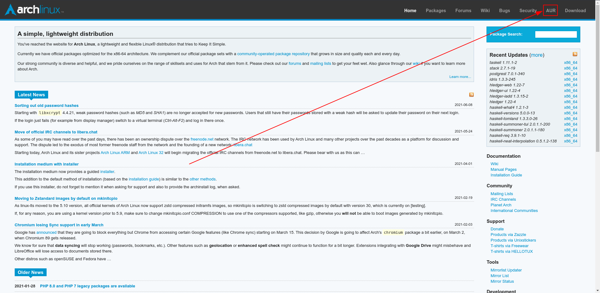

Quando entrar na aba do <b>AUR</b> basta digitar o nome do pacote/programa que você deseja instalar, no nosso caso do exemplo é o Google Chrome.

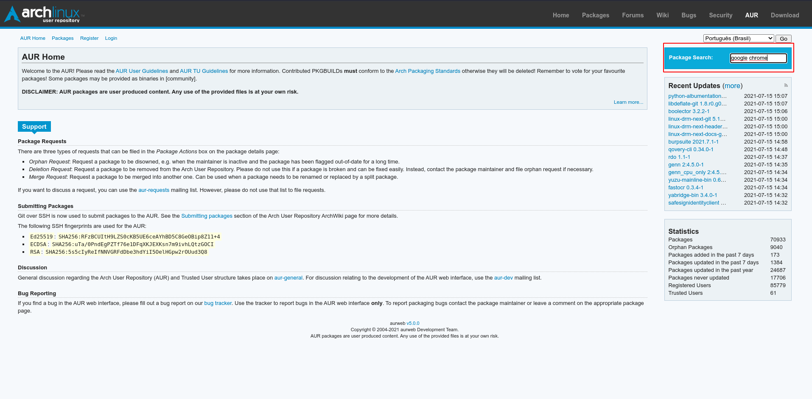

Já na próxima tela, basta procurar o link "google-chrome".

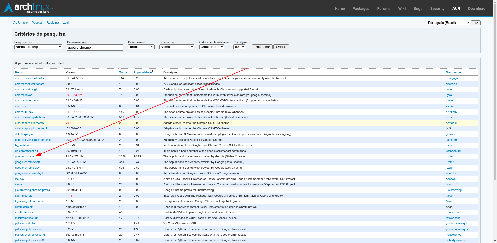

Depois disso, vamos precisar clonar o repósitorio do GitHub, e para isso vamos precisar instalar o git:

```bash
sudo pacman -S git
```

Depois de ter instalado o git, vamos pegar o link que está nessa página:

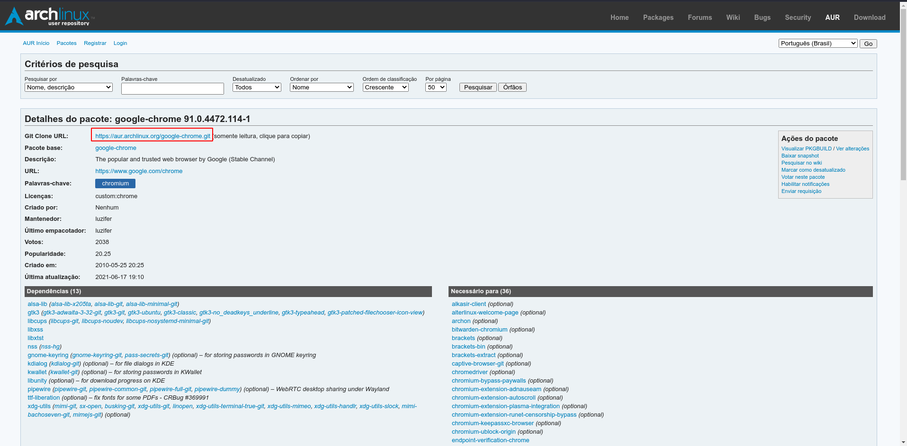

Basta copiar esse link, e digitar:

```bash
git clone https://aur.archlinux.org/google-chrome.git
```

### Obs: Preferencia que você esteja na pasta "/home/usuario", exemplo: "/home/gabriel", para clonar a pasta diretamente na sua pasta principal de usuário, e não apagar a pasta depois.

Depois de ter clonado o repositório, ele vai gerar essa nova pasta no seus arquivos:

 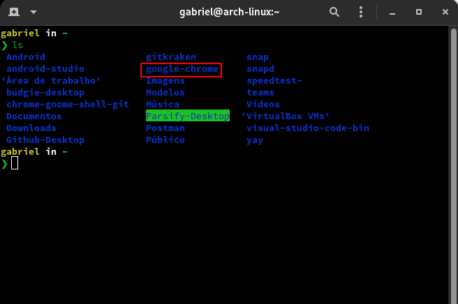

Depois disso, vamos entrar na basta "google-chrome", basta digitar:

```bash
cd google-chrome
```

Feito isso, vamos ver oque tem dentro da pasta, digite:

```bash
ls
```

Dentro da pasta vai ter os seguintes arquivos:

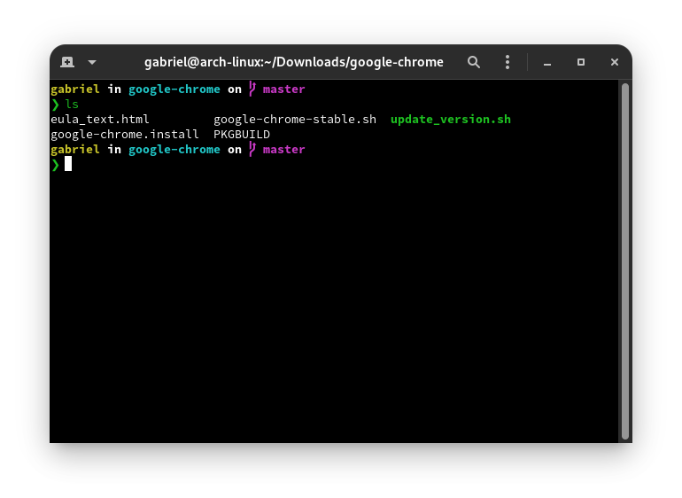

Antes de instalarmos o Google Chrome, precisamos instalar o "base-devel", que é ele que nos permite criar os pacotes:

```bash
sudo pacman -S base-devel
```

Depois disso vamos rodar o comando "makepkg" para ele criar os pacotes do Google Chrome:

```bash
makepkg -s
```

Feito isso ele vai criar alguns arquivos:


E o que vamos instalar vai ser o "google-chrome-91.0.4472.114-1-x86_64.pkg.tar.zst", para isso basta digitar:

```bash
sudo pacman -U google-chrome-91.0.4472.114-1-x86_64.pkg.tar.zst
```

Feito isso, o Google Chrome vai ter sido instalado, e você pode fazer isso para qualquer outro pacote AUR que você quiser instalar.

## <p id = "vscode"> VS Code

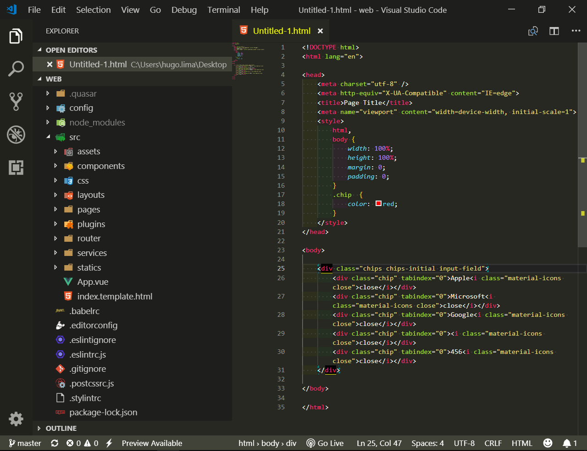

O Visual Studio Code é um editor de código-fonte desenvolvido pela Microsoft para Windows, Linux e macOS. Ele inclui suporte para depuração, controle de versionamento Git incorporado, realce de sintaxe, complementação inteligente de código, snippets e refatoração de código.

<video src="img/vs-code.mp4" type="video/mp4" autoplay loop controls muted>
  Your browser does not support the video tag.
</video>

Site oficial <a href = "https://code.visualstudio.com/"> VS Code</a>.

Para quem é desenvolvedor ele é um dos melhores editores de código, e para instalar ele no Arch basta entrar no AUR do <a href = "https://aur.archlinux.org/packages/visual-studio-code-bin/">VS Code</a> e fazer o mesmo que foi feito para instalar o Google Chrome.

</p>

## <p id = "teams"> Microsoft Teams


Microsoft Teams é uma plataforma unificada de comunicação e colaboração que combina bate-papo, videoconferências, armazenamento de arquivos e integração de aplicativos no local de trabalho.

Para instalar ele no Arch Linux, basta  entrar no AUR do <a href = "https://aur.archlinux.org/packages/teams/">Teams</a> e fazer o mesmo que foi feito para instalar o Google Chrome.

</p>

## <a href = "#font-manager">Font Manager</a>

Pacote AUR:

<a href = "https://aur.archlinux.org/packages/font-manager/">Font Manager AUR</a>.

</p>

***
<p id = "snap">


Site do <a href = "https://snapcraft.io/" target = "_blank"> Snapcraft</a>.

Snappy é um software de implantação e um sistema de gerenciamento de pacotes originalmente projetado e construído pela Canonical para o sistema operacional Ubuntu phone. Os pacotes, chamados de 'snaps' e a ferramenta para usá-los, 'snapd', funcionam por toda uma gama de distribuições Linux e, portanto, permitem implantação de software upstream de forma distro-agnostic. O sistema é projetado para funcionar em smartphones, nuvem, internet das coisas e ambiente de desktop.

Pacotes de software "snap" são auto-contidos e o funcionam por toda uma gama de distribuições Linux. Essa é uma abordagem diferente do pacote Linux tradicional, como o APT ou o RPM, que exigem pacotes especificamente adaptados para cada distribuição de Linux. Isso adiciona atraso entre o desenvolvimento de aplicações e de sua implementação para os usuários finais.

Snaps não possuem dependências de nenhuma loja de aplicativos, podem ser obtidos a partir de qualquer fonte e pode ser utilizado para implantação de software upstream. Quando snaps são implantados no Ubuntu e em outras versões de Linux, a loja de aplicativos do Ubuntu é utilizada como padrão de back-end, mas outras lojas podem ser ativados.

# Instalação

Antes de usar o snap para instalar algum aplicativo, precisamos instalar o snap na distro em que você está usando.

## Ubuntu

```bash
sudo apt update
```

```bash
sudo apt install snapd
```

## Linux Mint

Por padrão no Linux Mint o Snap vem "bloqueado", e para instalar o Snap remover esse "bloquador" basta digitar:

```bash
sudo rm /etc/apt/preferences.d/nosnap.pref
```

Depois atualizar o sistema:

```bash
sudo apt update
```

E por último instalar o snap:

```bash
sudo apt install snapd
```

Depois de ter instalado precisa reiniciar o computador. E para testar se funcionou basta digitar:

```bash
 snap install hello-world
```

```bash
 hello-world
```

Se ele retornar "Hello World!", é porque está funcionando.

## Fedora

```bash
sudo dnf install snapd
```

Faça logout e login novamente ou reinicie o sistema para garantir que os caminhos do snap sejam atualizados corretamente.

Para ativar o suporte de snap clássico, digite o seguinte para criar um link simbólico entre /var/lib/snapd/snap e /snap:

```bash
 sudo ln -s /var/lib/snapd/snap /snap
```

Faça logout e login novamente ou reinicie o sistema para garantir que os caminhos do snap sejam atualizados corretamente.

## Arch Linux

Para instalar o Snap no Arch, você tem que fazer igual para instalar o Google Chrome, ou outro pacote, primeiramente precisamos clonar o repósitorio do GitHub:

```bash
git clone https://aur.archlinux.org/snapd.git
```

Depois vamos entrar na pasta "snapd":

```bash
cd snapd
```

Depois vamos criar o pacote:

```bash
makepkg -si
```

Depos disso vamos instalar o snap:

```bash
sudo pacman -U snapd-2.51.1-1-x86_64.pkg.tar.zst
```

Depois de ter instalado o snap, vamos habilitar ele:

```bash
sudo systemctl enable --now snapd.socket
```

E por último vamos criar um link simbólico nas pasta "snap", para todos os aplicativos que forem instalados pelo snap:

```bash
 sudo ln -s /var/lib/snapd/snap /snap
```

Depois disso reinicie o seu computador, e faça o mesmo teste que fizemos no Linux Mint, para ver se está funcionando perfeitamente:

```bash
 snap install hello-world
```

```bash
 hello-world
```

Se tiver retornado "Hello World!", é porque está funcionando perfeitamente.

Vou colocar uma lista de alguns aplicativos que podem ser instalados pelo snap, mas caso você queira conhecer mais aplicativos, basta acessar o <a href = "https://snapcraft.io/" target = "_blank"> Snapcraft</a>, e escolher os aplicativos que deseja instalar, junto vai ter a opção de instalar pelo terminal ou pelo própria lojinha do Linux.

# Aplicativos Snap

## Bashtop

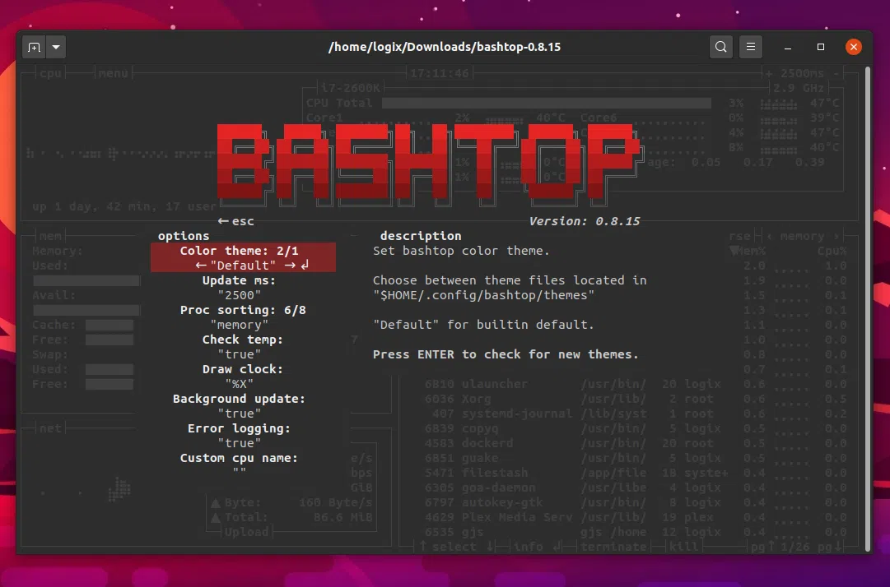


O [Bashtop](https://github.com/aristocratos/bashtop) é um monitor de recursos escrito em **Bash** para Linux. Ele mostra o **uso** e **estatísticas da CPU** (incluindo temperatura), **memória**, **discos**, **rede** e **processos**.

Essa ferramenta é bastante nova, mas já ganhou muita popularidade. Devido a pedidos para torná-lo multiplataforma, seu desenvolvedor está reescrevendo-o para usar a biblioteca **psutil** do **Python3** para coleta de dados, em vez de ferramentas específicas do [Linux](https://sempreupdate.com.br/tag/linux/).

Com o Bashtop, você pode mostrar **informações detalhadas de um processo** e finalizar, eliminar ou interromper um processo selecionado.

Embora muitas TUIs (interface de usuário com base em texto ou terminal) possuam a capacidade de usar o mouse para executar várias operações, não tente isso com o Bashtop, pois ele não oferece suporte ao mouse. Isso não o torna menos legal, especialmente quando você dá uma olhada no **menu inspirado em jogos** (que você pode abrir pressionando **m**):

A interface do usuário é responsiva, mas não mostra a mesma quantidade de informações em todos os tamanhos. Dependendo do tamanho do terminal, você verá mais/menos processos na lista de processos e mais/menos informações sobre CPU, memória e discos.

Para instalá-lo via snap, basta digitar:

```bash
sudo snap install bashtop
```

E para abri-ló basta digitar no terminal "bashtop", e ele vai abrir a interface de monitoramento como nas imagens.

```bash
bashtop
```

Para sair dele basta apertar a tecla "q", ou apertar "Esc" ou "m" que vai abrir o menu, e só ir em "Exit".

## HTOP


O **Htop** é um avançado sistema interativo visualizador de processos. Escrito para **Linux**, o **Htop** mostra uma lista frequentemente atualizada de processos que rodam no computador, e utiliza-se de cores para facilitar a leitura de informações sobre o processador, swap, status da memória entre outros.

Para instalá-lo via snap, basta digitar:

```bash
sudo snap install htop
```

E para abri-ló basta digitar no terminal "htop", e ele vai abrir a interface de monitoramento como nas imagens.

```bash
htop
```

Para sair dele basta apertar a tecla "q".

## GitKraken

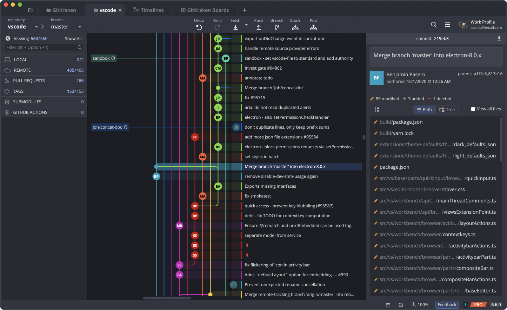

Site oficial <a href = "https://www.gitkraken.com/">gitkraken.com </a>.

A empresa Axosoft apresenta dois produtos: Axosoft, software ágil de gerenciamento de projetos, e GitKraken, um cliente Git de plataforma cruzada. O produto Axosoft é um sistema proprietário de gerenciamento de projetos e rastreamento de erros, desenvolvido pela Axosoft, LLC.

A interface de usuário de plataforma cruzada do GitKraken ajuda a entender o Git. Você pode abrir facilmente repositórios, definir favoritos e organizá-los em grupos de projetos. O GitKraken integra-se perfeitamente aos seus controles remotos GitHub, Bitbucket e GitLab e suporta arrastar e soltar para simplificar comandos complicados como mesclar, refazer e empurrar.

O GitKraken é uma ótima ferramenta para desenvolvedores, ajuda muito a entender o branch do git, e principalmente quando estamos trabalhando em equipe.

Para intalá-lo via snap, basta digitar:

```bash
sudo snap install gitkraken --classic
```

## <a href = "#discord"> Discord </a>

O Discord também tem a sua versão no snap, e para instalá-lo basta digitar:

```bash
sudo snap install discord --classic
```

## <a href = "#blender"> Blender </a>

Assim como o Discord, o Blender também tem a sua versão via snap, e para instalá-lo basta digitar:

```bash
sudo snap install blender --classic
```

## <a href = "#teams"> Teams </a>

Para instalar o Microsoft Teams via snap, basta digitar:

```bash
sudo snap install teams
```

## <a href = "#vscode"> VS Code </a>

Para instalar o Visual Studio Code via snap, basta digitar:

```bash
sudo snap install code --classic
```

De sempre preferência por instalar os aplicativos direto do site oficial, use o snap apenas se não tiver a versão do aplicativo para a distro que você estiver usando.

Para mais aplicativos snap, acesse o site oficial do <a href = "https://snapcraft.io/" target = "_blank"> Snapcraft</a>.

</p>

***
<p id = "flatpak">


Site do <a href = "https://flathub.org/home" target = "_blank"> Flathub</a>.

O Flathub tem como objetivo ser o lugar para obter e distribuir aplicativos para Linux. Ele é desenvolvido por Flatpak, que permite que aplicativos Flathub sejam executados em quase todas as distribuições Linux.

Flatpak, anteriormente conhecido como xdg-app, é um utilitário para implantação de software, gestão de pacote e virtualização para Linux. Uma aplicação empacotada no formato Flatpak provê um ambiente sandbox onde o usuário pode executar programas em isolamento do resto do sistema, ou seja, onde cada aplicação empacotada possui apenas as bibliotecas necessárias para a execução do programa.

Aplicações usando Flatpak necessitam de autorização prévia do usuário para usar o hardware ou acessar arquivos do sistema, semelhante aos aplicativos para o sistema operacional Android.

Diferente do Snappy, o Flatpak foi desenvolvido para ser descentralizado, permitindo adicionar diferentes fontes de programas. Uma fonte popular de aplicativos no formato Flatpak é o Flathub. Atualmente, alguns programas populares disponíveis inclui Mozilla Firefox, GIMP, Inkscape, LibreOffice, Pitivi, KDE Applications, e alguns não oficiais como Chromium, Blender, Spotify, Skype, Discord, e Steam.

# Instalação

Antes de usar o flatpak para instalar algum aplicativo, precisamos instalar o flatapk na distro em que você está usando.

## Ubuntu

```bash
sudo apt flatpak
```

Caso de algum erro, e não instale o flatpak, tenta a seguna maneira:

```bash
 sudo add-apt-repository ppa:alexlarsson/flatpak
```

```bash
sudo apt update
```

```bash
sudo apt install flatpak
```

Depois de ter instalado o flatpak, instale o plugin Software Flatpak, ele serve para o aplicativo de software torna possível instalar aplicativos sem a necessidade da linha de comando. Para instalar, execute:

```bash
sudo apt install gnome-software-plugin-flatpak
```

### Nota: o aplicativo de software é distribuído como um Snap desde o Ubuntu 20.04 e não oferece suporte à instalação gráfica de aplicativos Flatpak. A instalação do plugin Flatpak também instalará uma versão deb do Software e resultará na instalação de dois aplicativos de software ao mesmo tempo.

### Adicione o repositório Flathub

Flathub é o melhor lugar para obter aplicativos Flatpak. Para habilitá-lo, execute:

```bash
flatpak remote-add --if-not-exists flathub https://flathub.org/repo/flathub.flatpakrepo
```

Depois disso, basta reiniciar o computador.

## Fedora

O Flatpak é instalado por padrão na estação de trabalho Fedora. Para começar, tudo que você precisa fazer é habilitar o Flathub, que é a melhor maneira de obter aplicativos Flatpak. 

```bash
flatpak remote-add --if-not-exists flathub https://flathub.org/repo/flathub.flatpakrepo
```

## Arch Linux

Para instalar o Flatpak no Arch é bem simples, basta digitar:

```bash
sudo pacman -S flatpak

```

Vou colocar uma lista de alguns aplicativos que podem ser instalados pelo snap, mas caso você queira conhecer mais aplicativos, basta acessar o <a href = "https://snapcraft.io/" target = "_blank"> Snapcraft</a>, e escolher os aplicativos que deseja instalar, junto vai ter a opção de instalar pelo terminal ou pelo própria lojinha do Linux.

# Aplicativos Flatpak

##  Hydrapaper

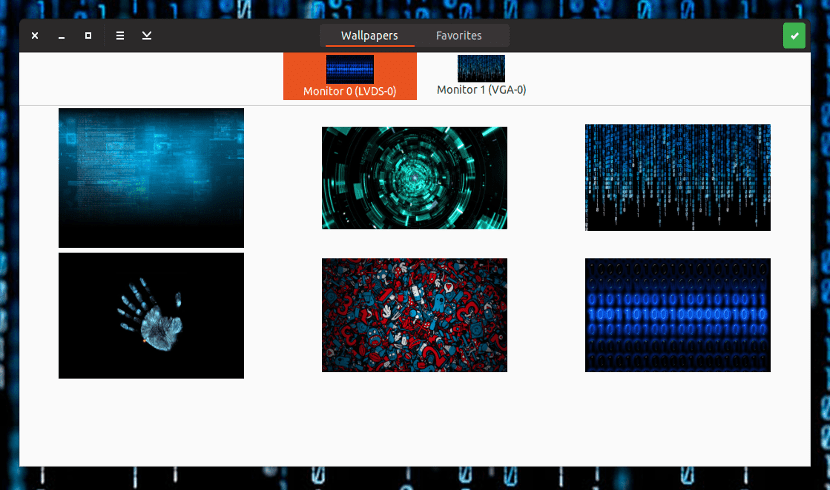

Quem utiliza mais de um monitor no Linux talvez já se deparou com a impossibilidade de utilizar papéis de parede distintos em cada desktop. Essa limitação do Gnome-Shell pode ser contornada com um simples programa.

O HydraPaper é um gerenciador de papéis de parede com suporte multi-monitor para o GNOME. Através dele a utilização de diferentes wallpapers em cada monitor será uma realidade. Para ser sincero, o HydraPaper utiliza uma biblioteca Python chamada Pillow e mescla ambas imagens, configurando-as como um único wallpaper com a opção “Estender” habilitada. Parece uma gambiarra que contorna o “problema”, mas sejamos honestos, "o mundo é dos mais espertos".

Mais sobre o <a href = "https://diolinux.com.br/editorial/papeis-de-parede-diferentes-em-cada-monitor.html">Hydrapaper</a>.

Para instalá-lo basta digitar:

```bash
flatpak install flathub org.gabmus.hydrapaper
```

## <p id = "steam-flatpak"> <a href = "#steam"> Steam </a>

Para instalá-lo basta digitar:

```bash
flatpak install flathub com.valvesoftware.Steam
```

</p>

## Figma

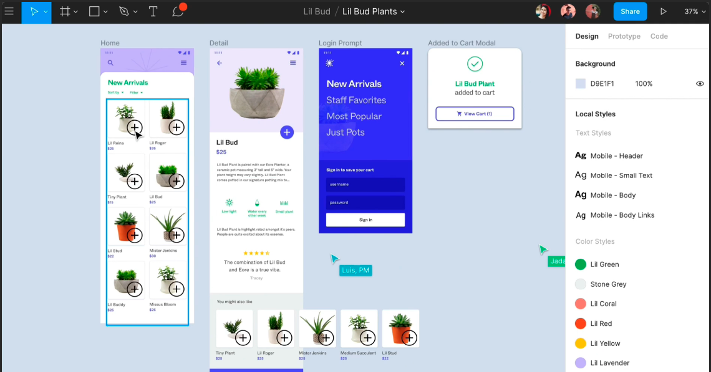

Figma é um editor gráfico de vetor e prototipagem de projetos de design baseado principalmente no navegador web, com ferramentas offline adicionais para aplicações desktop para GNU/Linux, macOS e Windows.

Ele é uma alternativa ao Adobe Xd para quem usa Linux, e ainda pode ser acessado pela Web, sem precisar instalar nenhum programa.

Site Oficial: <a href = "https://www.figma.com/files/recent?fuid=979871240670454319"> Figma.com</a>.

Para instalá-lo basta digitar:

```bash
flatpak install flathub io.github.Figma_Linux.figma_linux
```

## Gromit

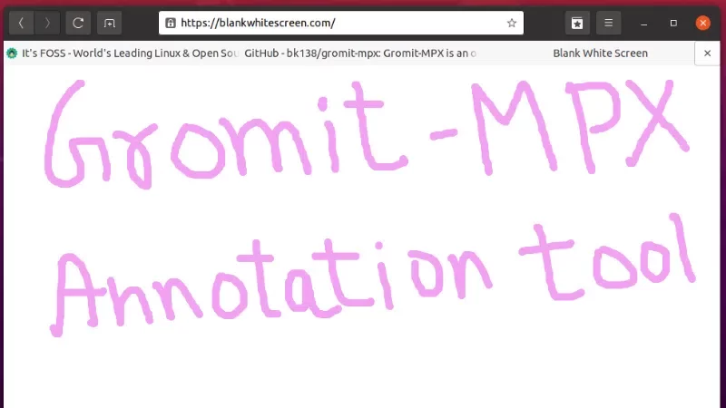

[Gromit-MPX (GRaphics Over Miscellaneous Things)](https://github.com/bk138/gromit-mpx#gromit-mpx) é uma ferramenta de [anotação](https://www.edivaldobrito.com.br/krita-no-linux-via-snap/) de tela que funciona em qualquer ambiente de trabalho Unix, sob X11 e Wayland.

Sua principal funcionalidade é nos ajudar nas apresentações.

Normalmente, teríamos que mover o ponteiro do mouse ao redor do ponto de interesse até que, com sorte, todos percebam. Com o Gromit-MPX, podemos desenhar em qualquer lugar da tela, destacando um botão ou área em que queremos focar a atenção.

Gromit-MPX é um utilitário para fazer anotações em toda a área de trabalho e nas janelas exibidas.

A ferramenta de anotação original é o Gromit e também usa a função Multi-Pointer X.org. Esta ferramenta é um software gratuito e de código aberto.

O programa é executado em segundo plano e é ativado sob demanda, o que nos permite desenhar em todos os aplicativos que estão sendo executados na área de trabalho.

O desenho fica na tela o tempo que quisermos. Caso não gostemos do desenho, com o botão direito do mouse, podemos deletar o que não gostamos.

Para instalá-lo basta digitar:

```bash
flatpak install flathub net.christianbeier.Gromit-MPX
```

## PDF Arranger

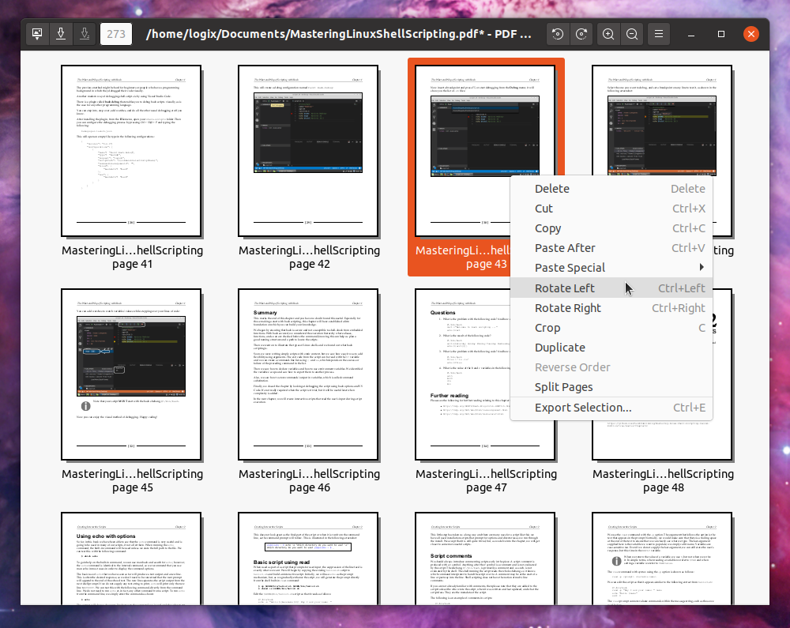

Se você precisa fazer alterações em arquivos PDF com facilidade, conheça e veja como instalar o incrível utilitário PDFArranger no Linux.

[PDFArranger](https://github.com/jeromerobert/pdfarranger) é uma pequena ferramenta que permite dividir, mesclar, girar e reorganizar um ou mais arquivos PDF no Linux.

Ele é um pequeno aplicativo python-gtk, que ajuda o usuário a mesclar ou dividir documentos PDF e rodar, cortar e reorganizar suas páginas através de uma interface gráfica interativa e intuitiva.

O PDFArranger é na verdade um fork do projeto PDF-Shuffler, já que este último não foi desenvolvido nos últimos anos.

O PDFArranger é uma tentativa humilde de tornar este projeto um pouco mais atraente, mesmo que até o ícone de ambos os projetos seja o mesmo.

Tenha em mente que o PDFArranger não é um visualizador de PDF. Você não pode clicar duas vezes em um PDF e ler seu conteúdo.

Portanto, use seu leitor de PDF habitual para lê-los, anote os detalhes e use o PDFArranger de acordo com suas necessidades. Você precisará saber os números de página exatos que deseja cortar ou mesclar.

Você pode arrastar e soltar arquivos PDF no aplicativo PDFArranger em execução ou clicar no botão de menu para abrir o arquivo desejado com o PDFArranger.

Nos mostrará o documento, página por página. Isso levará algum tempo e uso da CPU ao abrir o arquivo. Mas esse consumo é reduzido ao mínimo quando o arquivo é totalmente aberto.

Para instalá-lo basta digitar:

```bash
flatpak install flathub com.github.jeromerobert.pdfarranger
```

## Apostrophe

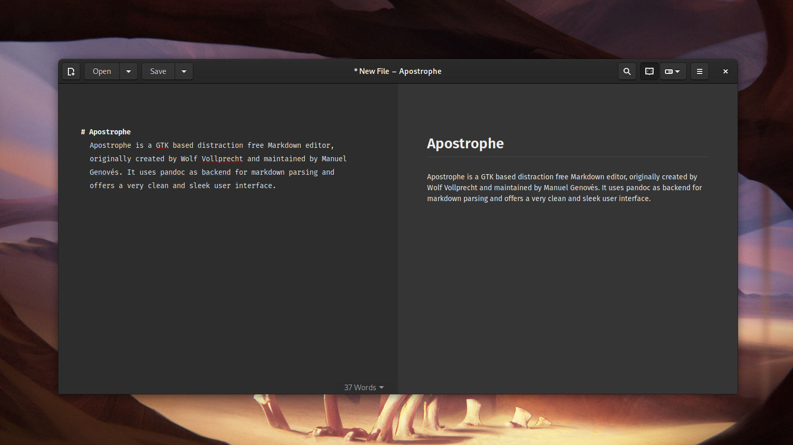

**Apostrophe** é um editor de Markdown sem distrações baseado em GTK, criado originalmente por Wolf Vollprecht e mantido por Manuel Genovés. ... Esse editor usa o pandoc como back-end para markdown parsing e oferece uma interface de usuário muito limpa e elegante. A visualização em linha facilita a escrita do Markdown.

Para instalá-lo basta digitar:

```bash
flatpak install flathub org.gnome.gitlab.somas.Apostrophe
```

## Typora

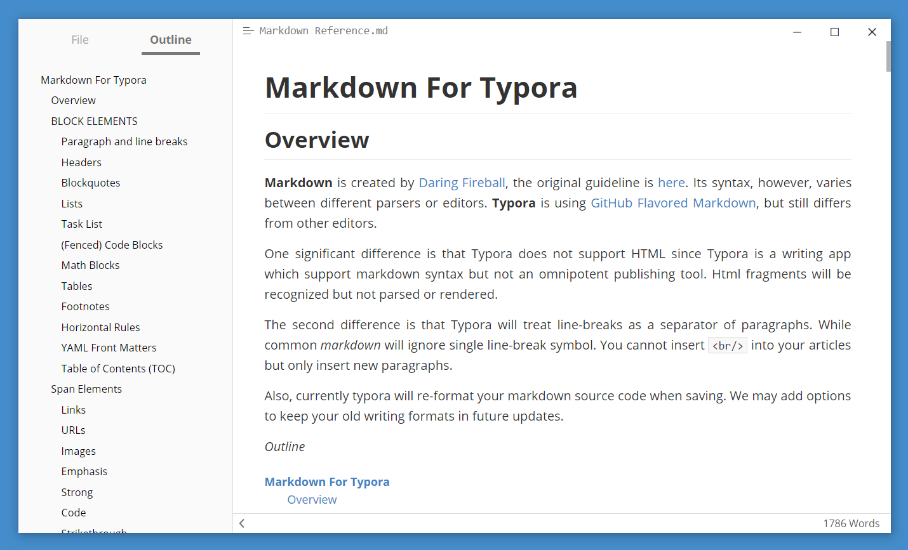

[Typora](https://typora.io/) é um editor de markdown mínimalista, fornecendo novas maneiras de ler e escrever markdown. Atualmente está em beta. Ele é um software comercial (não de código aberto), mas é gratuito durante a versão beta.

O Typora no GitHub oferece suporte à colaboração entre seu desenvolvedor, Abner Lee, e sua comunidade de usuários, fornecendo um local para relatar problemas de maneira transparente, coletar feedback e discutir a direção futura.

Ele também fornece recursos de código aberto para personalização de temas pelo usuário.

O editor de markdown do Typora é uma excelente ferramenta para escrever markdown.

Para instalá-lo basta digitar:

```bash
flatpak install flathub io.typora.Typora
```

## Unity

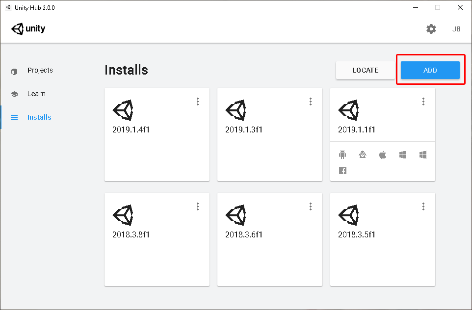

**Unity Hub** permite encontrar, baixar e gerenciar mais facilmente suas instalações do **Unity** Editor e visualizar todos os projetos **Unity**. Além disso, o **Unity Hub** ajuda você a descobrir novas funções que facilitam a inicialização - como por exemplo Templates.

Para instalá-lo basta digitar:

```bash
flatpak install flathub com.unity.UnityHub
```

## GPU Viewer

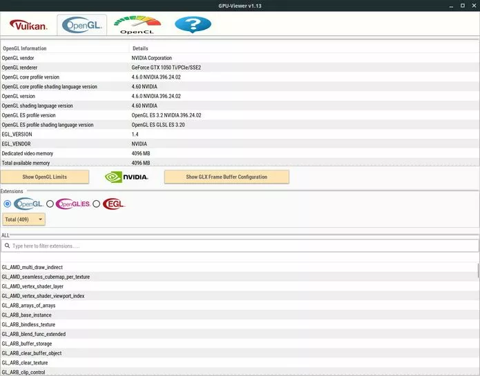

**GPU**-**Viewer** é um aplicativo que permite capturar todos os detalhes importantes de glxinfo, vulkaninfo e clinfo em uma interface gráfica. Na prática, ele é um front-end para glxinfo, vulkaninfo, clinfo e es2_info. O projeto está sendo desenvolvido usando python 3 pygobject com o GTK3.

Para instalá-lo basta digitar:

```bash
flatpak install flathub io.github.arunsivaramanneo.GPUViewer
```

##  GTKStressTesting

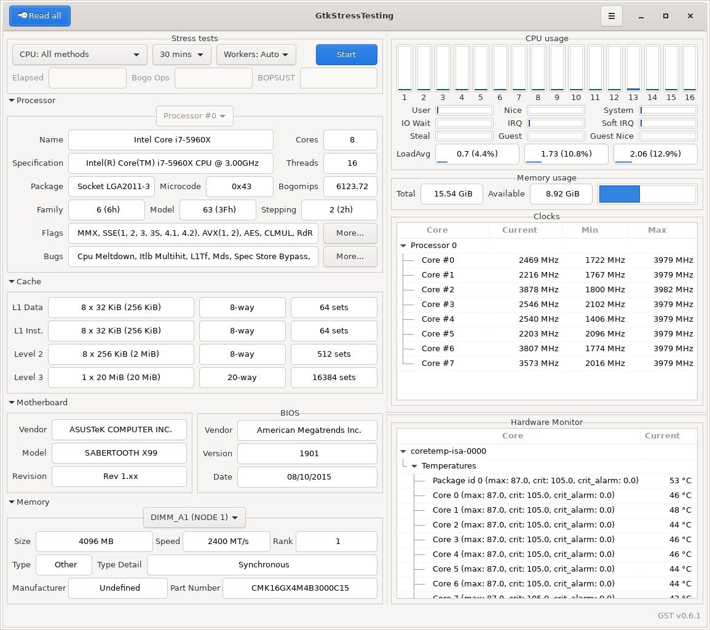

**GtkStressTesting**, ou GST, é um utilitário de sistema GTK projetado para enfatizar e monitorar vários componentes de hardware, como CPU e RAM. Com ele você pode executar diferentes testes de estresse de CPU e memória e benchmark de núcleo único e múltiplo.

Para instalá-lo basta digitar:

```bash
flatpak install flathub com.leinardi.gst
```

## Bottles


Se você quer executar aplicativos e jogos do Windows no Linux, conheça e veja como instalar a interface Wine Bottles no Linux via Flatpak.

O [Bottles](https://usebottles.com/) é uma ferramenta moderna que aprimora e simplifica a execução de software Windows no Linux!

Seu sistema de instalação de dependência integrado permite fácil acesso a um amplo nível de compatibilidade de software. Ele também possui um gerenciador de download para baixar os componentes oficiais: runner ([wine](https://www.edivaldobrito.com.br/versao-mais-recente-do-wine-no-ubuntu/), proton), dxvk, dependências, etc.

Além disso, recursos como controle de versão de garrafa permitem que você mantenha seu trabalho seguro e restaure-o mais tarde!

Bottles possui as seguintes características:

- Crie suas garrafas (Bottles) usando ambientes pré-configurados ou crie seus próprios
- Execute todos os executáveis (.exe/.msi) em suas garrafas, diretamente do menu de contexto de seu gerenciador de arquivos
- Detecção automatizada de aplicativos instalados em suas garrafas
- Adicione variáveis de ambiente facilmente
- Substituir DLLs diretamente das preferências de garrafa
- Mudança de corredor em tempo real para qualquer garrafa
- Várias otimizações para melhor desempenho de jogos (esync, fsync, dxvk, cache, compilador de sombreador, descarregamento … e muito mais).
- Instalação automática e gerenciamento de corredores Wine e Proton
- Reparo automático de garrafas em caso de quebra
- Instalador de dependências integradas baseado em um repositório de driver de comunidade
- Gerenciador de tarefas integrado para processos de vinho
- Fácil acesso ao ProtonDB e WineHQ para suporte
- As configurações atualizam o sistema nas versões das garrafas
- Backup e importação de garrafas
- Importe facilmente o wineprefix de outros gerentes
- Controle de versão de garrafas (experimental)
- .. e muito mais que você pode encontrar instalando o Bottles!

Para instalá-lo basta digitar:

```bash
flatpak install flathub com.usebottles.bottles
```

## Color Peek

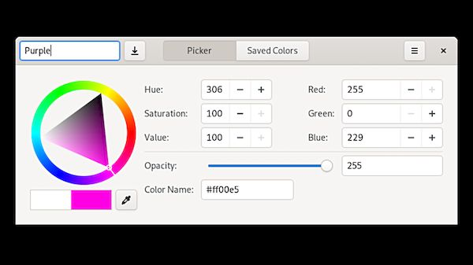

Se você precisa descobri as cores que estão na tela do PC, conheça e veja como instalar o seletor de cores Color Picker no Linux via Flatpak.

Sempre quis saber o valor dessa cor em sua tela? O Seletor de cores [Color Picker](https://hjdskes.nl/projects/gcolor3/) permite que você escolha a cor de qualquer pixel da tela. Também oferece uma paleta, para que você possa misturar e combinar facilmente algumas cores.

Quando você encontrar a combinação perfeita de cores, naturalmente deseja salvá-las. O Color Picker permite que você salve e recupere cores de maneira conveniente.

Color Picker é uma caixa de diálogo de seleção de cores escrita em GTK 3. É muito parecida com Gcolor2, mas usa a versão GTK mais recente e outras modernizações para se integrar melhor ao seu desktop moderno.

Para instalá-lo basta digitar:

```bash
flatpak install flathub nl.hjdskes.gcolor3
```

## Font Finder

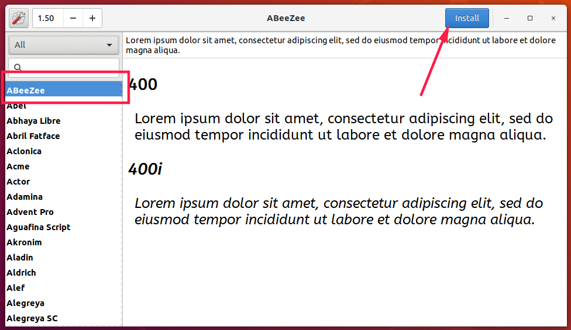

**Font Finder** é um aplicativo gratuito de código aberto para **Linux** que permite filtrar, classificar e instalar fontes do imenso arquivo do Google **Fonts**.

Para instalá-lo basta digitar:

```bash
flatpak install flathub io.github.mmstick.FontFinder
```

## Minder


Se você quer organizar suas ideias na tela do PC, conheça e veja como instalar o app de mapeamento mental minder no Linux via Flatpak.

 O minder é um aplicativo de mapeamento mental criado especialmente para o sistema operacional elementaryOS, mas que você pode usar em qualquer sistema Linux com suporte ao formato Flatpak.

Use o poder do mapeamento mental para dar vida às suas idéias.

- Crie rapidamente mapas mentais visuais usando o teclado e o layout automático.
- Escolha entre várias opções de layout de árvore.
- Adicione notas, tarefas e imagens aos seus nós.
- Adicione conexões nó a nó com texto e notas opcionais.
- Estilize nós, links e conexões para adicionar mais significado e melhorar a legibilidade.
- Pesquisa rápida de títulos e notas de nó e conexão, incluindo opções de filtragem.
- Aumente o zoom ou ative o modo de foco para focar em certas idéias ou diminua o zoom para ver a foto maior.
- Entre no modo de foco para melhor visualizar e entender partes do mapa.
- Ilimitado desfazer/refazer qualquer alteração.
- Salva automaticamente em segundo plano.
- Ramificações de nós coloridos.
- Abra vários mapas mentais com o uso de guias.
- Tema incorporado e personalizável.
- Animações lindos.
- Importe dos formatos OPML, FreeMind, Freeplane, PlainText (formatado), Outliner e Portable Minder.
- Exporte para os formatos CSV, FreeMind, Freeplane, JPEG, BMP, SVG, Markdown, Mermaid, OPML, Org-Mode, Outliner, PDF, PNG, Portable Minder, PlainText e yEd.
- Use o suporte a impressora.

Para instalá-lo basta digitar:

```bash
flatpak install flathub com.github.phase1geo.minder
```

## Peek

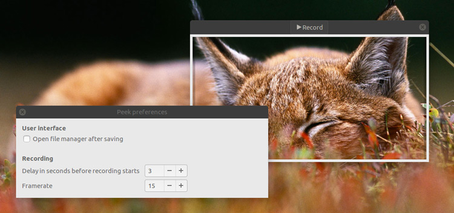

Se você precisa gravar uma seleção de sua tela para uma imagem GIF animada. Veja como instalar o Peek Animated GIF recorder no Linux.

[O Peek](https://github.com/phw/peek) é um utilitário de código aberto para Linux que oferece uma janela simples, que pode ser redimensionada para selecionar uma área de tela, e gravar imagens GIF animadas curtas.

O Peek foi construído para o caso de uso específico de áreas de tela de gravação, e para mostrar facilmente os recursos de interface de seus próprios aplicativos ou para mostrar um bug nos relatórios de erros.

Com Peek você simplesmente coloca a janela Peek sobre a área que deseja gravar e pressione “Record” (gravar).

Peek está otimizado para gerar GIFs animados, mas você também pode gravar diretamente para WebM ou MP4, se você preferir.

Peek não é um aplicativo de screencast de propósito geral com recursos estendidos, mas enfoca a única tarefa de criar pequenas e silenciosas cenas de tela de uma área da tela, para criar animações GIF ou vídeos silenciosos WebM ou MP4.

Ele é executado no X11 ou dentro de uma sessão GNOME Shell Wayland usando o XWayland. O suporte para mais desktops do Wayland poderá ser adicionado no futuro.

Para instalá-lo basta digitar:

```bash
flatpak install flathub com.uploadedlobster.peek
```

## <p id ="blender-flatpak"> Blender

O Blender  tem a sua versão via flatpak, e para instalá-lo basta digitar:

```bash
flatpak install flathub org.blender.Blender
```

</p>

## Spotify


Spotify é um serviço de streaming de música, podcast e vídeo que foi lançado oficialmente em 7 de outubro de 2008. É o serviço de streaming mais popular e usado do mundo. Ele é desenvolvido pela startup Spotify AB em Estocolmo, Suécia. 

Para instalá-lo via Flatpak basta digitar:

```bash
flatpak install flathub com.spotify.Client
```


</p>

***

# Instalando linguagens de programação

## Java

Site oficial de Download do <a href = "https://www.oracle.com/java/technologies/">Java</a>, basta acessar o site, escolher a versão quer você deseja instalar e escolher o Sistema Operacional que você está usando. Ou se preferir instalar por outra versão direto pelo terminal no Ubuntu ou Fedora:

### Ubuntu

Para instalar o Java no Ubuntu e derivados basta digitar:

```bash
sudo apt-get install openjdk-11-jdk
```

Caso você queira instalar outra versão do Java, basta substituir o "11" pelo número da versão que deseja, exemplo:

```bash
sudo apt-get install openjdk-8-jdk
```

### Fedora

Para instalar o Java no Fedora basta digitar:

```bash
sudo dnf install java-11-openjdk.x86_64
```

Ou para instalar a ultima versão basta digitar:

```bash
sudo dnf install java-latest-openjdk.x86_64
```

### Arch Linux

Para instalar o Java no Arch Linux basta digitar:

```bash
sudo pacman -S jdk11-openjdk
```

## PHP

### Ubuntu

Para instalar o php no Ubuntu é mais simples ainda do que o Java, basta apenas digitar:

```bash
sudo apt-get install php
```

### Fedora

Para instalar o php no Fedora é mais simples ainda do que o Java, basta apenas digitar:

```bash
sudo dnf install php
```

### Arch Linux

Para instalar o php no Arch Linux é mais simples ainda do que o Java, basta apenas digitar:

```bash
sudo pacman -S php
```

## Python 3

### Ubuntu

Caso o python 3 não venha como padrão no Ubuntu e sim o Python 2, para instalá-lo é bem simples também, basta digitar:

```bash
sudo apt-get install python3
```

E para colocar ele como padrão para debugar o código, basta digitar:

```bash
sudo rm /usr/bin/python
```

Que ele vai remover o python 2 do link do Path, e depois digitar:

```bash
sudo ln -s python3 /usr/bin/python
```

Que ele vai criar um novo link no Path apontando para o Pythn 3.

### Fedora

Para instalar o Python 3 no Fedora basta digitar:

```bash
sudo dnf install python
```

### Arch Linux

Para instalar o Python 3 no Arch Linux basta digitar:

```bash
sudo pacman -S python
```

## .NET

Para instalar o .NET no linux, tem a explicação pelo próprio site da microsoft, basta seguir o tutorial escolhendo a distro que você está usando:

<a href = "https://docs.microsoft.com/pt-br/dotnet/core/install/linux">Instação .NET</a>.

## NodeJs

Para instalar o node no Ubuntu ou Fedora basta seguir o link para a instalação do <a href="https://github.com/nodesource/distributions/blob/master/README.md"> NodeJs</a>, que vai ter um README no github com todas as distros e como instalar via package manager.

Ou se quiser instalar a última versão:

### Ubuntu

```bash
sudo apt-get install nodejs
```

### Fedora

```bash
sudo dnf install nodejs
```

### Arch Linux

```bash
sudo pacman -S  nodejs npm
```

Tanto no Ubuntu quanto no Fedora, o npm já vem instalado junto com o NodeJs, no caso do Arch Linux tem que instalar os dois, pois não instala o npm junto do NodeJs.

## TypeScript

Se você está aprendendo TypeScript e quer instlar ele, depois de ter instalado o NodeJs, basta digitar:

```bash
sudo npm install -g typescript 
```

O "-g" serve para instalar ele de forma global no seu Sistema, sendo assim, não vai precisar ficar instlando ele toda vez que for criar uma pasta nova.

Para rodar o TypeScritp para saber se o código está funcionando corretamente, tem uma forma que é pelo Node igual com o JavaScript, só que não diretamente com o mesmo Node que o JavaScript usa, e sim com o Typescript Node, para instalá-lo é bem simples:

```bash
sudo npm install -g ts-node
```

Para importar bibliotecas do TypeScript basta instalar o typescript-require:

```bash
sudo npm install -g typescript-require
```
e
```bash
sudo npm install -g @types/node 
```

